# msvs_onebitadc
# Index
- [Installation of Oracle Virtual Box with Ubuntu 22.04](#1-installation-of-oracle-virtual-box-with-ubuntu-2204)
- [Installation of Tools and SKY130 PDKs](#2-installation-of-tools-and-sky130-pdks)
  * [Magic](#2a-magic)
  * [Ngspice](#2b-ngspice)
  * [Netgen](#2c-netgen)
  * [Xschem](#2d-xschem)
  * [Open_PDKs](#2e-open_pdks)
  * [ALIGN Tool](#2f-align-tool)
- [WEEK 1](#week-1)
    * [Simulation of Inverter using Xschem and Ngspice](#3-simulation-of-inverter-using-xschem-and-ngspice)
        + [Pre-layout Simulation](#3a-pre-layout-simulation-using-xschem-and-ngspice)
            + [ DC Analaysis](#3ai-dc-analaysis-of-cmos-inverter)
            + [ Transient Analysis](#3aii-transient-analaysis-of-cmos-inverter)
    - [Simulation of Inverter Netlist (manually made) using Ngspice](#4-simulation-of-inverter-using-ngspice)
  * [Pre-layout Simulation (Netlist from Xschem)](#4a-pre-layout-simulation-of-inverter-using-ngspice)
  * [Post-layout Simulation (Netlist from Magic )](#4b-post-layout-simulation-of-inverter-using-ngspice)
  * [Comparison of pre-layout and post-layout timing parameters](#4c-comparison-of-pre-layout-and-post-layout-timing-parameters-for-inverter)
  * [LVS Report](#4d-lvs-report)
  

- [WEEK 2](#week-2)
    * [Inverter Layout generation using ALIGN](#5-generating-inverter-layout-using-align)
        - [Generated Inverter Layout](#5a-generated-layout-using-align)
        - [Netlist generation from magic(for ALIGN inverter)](#5b-extracted-netlist-from-magic)
        - [Characterisation using NGSPICE(Post-Layout)](#5c-simulation-of-the-netlist-using-ngspice)

    - [Simulation of a function *Fn= [(B+D).(A+C)+E.F]'* using Magic and Ngspice](#6-prelayout-and-postlayout-simulation-of-a-function-fn--bdacef)
        * [Schematic drawing for Function using Xschem](#6a-drawing-the-schematic-for-fn-in-xschem)
        * [Pre-layout simulation using NGSPICE](#6b-prelayout-simulation-using-ngspice-function_newsp)
        * [Manual Layout using Magic and Post-layout simulation](#6c-postlayout-simulation-of-fn-using-magic-manual-layout)
        * [Post-layout Simulation of Function using ALIGN generated Layout](#6d-postlayout-simulation-of-fn-using-align)
        * [Common issues faced with ALIGN](#6e-issues-while-using-align)
  
# 1. Installation of Oracle Virtual Box with Ubuntu 22.04

1. Create a new directory **Opensourcetoolinstall** in D: Drive. Make sure there is atleast 150 GB disk space in the drive.
2. Go to [https://www.virtualbox.org/wiki/Downloads](https://www.virtualbox.org/wiki/Downloads)
3. Under VirtualBox 7.0.6 platform packages, click on **Windows hosts** save the .exe file in **Opensourcetoolinstall** folder.
4. Install the VirtualBox.
5. Download **Ubuntu 22.04.1 LTS** from [https://ubuntu.com/download/desktop](https://ubuntu.com/download/desktop) and save the .exe file in **Opensourcetoolinstall** folder.
6. Install Ubuntu 22.04.1 LTS in the virtualbox.

# 2. Installation of Tools and SKY130 PDKs
## 2.a. Magic
Magic is an open-source VLSI layout tool.
Install magic and its dependencies using the following commands. The dependencies can also be installed using Synaptic Manager. Synaptic manager can be first installed using `sudo apt install synaptic`.\

```
# Ipdate your system
    $sudo apt update
    $sudo apt install -y git
# Install build-essential tools
    $sudo apt install -y build-essential
# Install csh
    $sudo apt install -y csh
# Install x11
    $sudo apt install -y x11-apps
# Install X11
    $sudo apt install -y x11-xserver-utils
# Install OpenGL
    $sudo apt install -y libglu1-mesa-dev freeglut3-dev mesa-common-dev
# Cnstall Tcl/Tk
    $sudo apt install -y tcl-dev tk-dev
# Change to the work directory
    $cd ~/VSD_8TSRAM
# Clone the git repo
    $git clone git://opencircuitdesign.com/magic
# Change into the magic directory
    $cd magic
# Configure magic
    $./configure
# Build magic
    $make
# Install magic
    $sudo make install
```
## 2.b. Ngspice
Ngspice is the open source spice simulator for electric and electronic circuits. 
Download ngspice-39 tarball `ngspice-39.tar.gz`from [https://ngspice.sourceforge.io/download.html](https://ngspice.sourceforge.io/download.html) into the work directory. Install ngspice and all its dependicies using the following commands. 
```
# Home directory
    $cd ~/VSD_8TSRAM
    $tar -xzvf ngspice-39.tar.gz
    $mkdir release
    $cd release 
# Update the system
    $sudo apt-get update
# Install Xaw library
    $sudo apt-get -y install libxaw7-dev
# Install xterm
    $sudo apt-get -y install xterm
# Install bison
    $sudo apt-get -y install bison
# Install flex
    $sudo apt-get -y install flex
# Install readlines library
    $sudo apt-get -y install libreadlines6-dev
# Run configuration
    $../configure  --with-x --with-readline=yes --disable-debug
# Build
    $make 
# Install 
    $sudo make install
```
## 2.c. Netgen
Netgen is a tool for comparing netlists, a process known as LVS, which stands for "Layout vs. Schematic". Install netgen and all its dependicies using the following commands. 

```
# Home directory
cd ~/VSD_8TSRAM
# Install GNU m4
sudo apt-get install -y m4
# Clone the repository
git clone git://opencircuitdesign.com/netgen
cd netgen
# Configure the package
./configure
# Compile the package
make
# Install the package
sudo make install
```
## 2.d. Xschem
Xschem is a schematic capture program, it allows creation of hierarchical representation of circuits with a top down approach. Install xschem and all its dependicies using the following commands. 

```
# Home directory
    $cd ~/VSD_8TSRAM
# Update the system
    $sudo apt-get update 
# Install flex and bison
    $sudo apt-get install -y flex bison
# Install libjpeg-dev 
    $sudo apt-get -y install libjpeg-dev
# Install xcb
    $sudo apt-get -y install xcb
# Clone the repository
    $git clone https://github.com/StefanSchippers/xschem.git xschem-src
    $cd xschem-src
# Configure the installation
    $./configure
# Compile the source
    $make
# Install the software
    $sudo make install
```

## 2.e. Open_PDKs
Open_PDKs is distributed with files that support the Google/SkyWater sky130 open process description https://github.com/google/skywater-pdk. Open_PDKs will set up an environment for using the SkyWater sky130 process with open-source EDA tools and tool flows such as magic, qflow, openlane, netgen, klayout, etc.More information can be found on [http://opencircuitdesign.com/open_pdks/](http://opencircuitdesign.com/open_pdks/).
Install open_pdks using the following commands.

```
# Home directory
    $cd ~/VSD_8TSRAM
# Install setup-tools
    $sudo apt-get -y install python3-setuptools
# Clone the Open PDK repository
    $git clone git://opencircuitdesign.com/open_pdks
    $cd open_pdks
# Configure Open PDK to use Sky130 libraries
    $./configure --enable-sky130-pdk
# Compile the PDK
    $make 
# Install the PDK
    $sudo make install
```
## 2.f. ALIGN Tool
ALIGN is an open source automatic layout generator for analog circuits. Install ALIGN and all its dependencies using the following commands.

```
# Home directory
    $cd ~/VSD_8TSRAM
# Clone the ALIGN source
    $git clone https://github.com/ALIGN-analoglayout/ALIGN-public
    $cd ALIGN-public
# Install virtual environment for python
    $sudo apt -y install python3.8-venv
# Install the latest pip
    $sudo apt-get -y install python3-pip
# Create python virtual envronment
    $python3 -m venv general
    $source general/bin/activate
    $python3 -m pip install pip --upgrade
    $pip install align
    $pip install pandas
    $pip install scipy
    $pip install nltk
    $pip install gensim
    $pip install setuptools wheel pybind11 scikit-build cmake ninja
# Install ALIGN as a user
    $pip install -v .
# Install ALIGN  as a developer
    $pip install -e .
    $pip install -v -e .[test] --no-build-isolation
    $pip install wheel setuptools pip --upgrade
    $pip3 install wheel setuptools pip --upgrade
    $pip install -v --no-build-isolation -e . --no-deps --install-option='-DBUILD_TESTING=ON'
```
#### Making ALIGN Portable to Sky130 tehnology
Clone the following Repository inside ALIGN-public directory
```
    $git clone https://github.com/ALIGN-analoglayout/ALIGN-pdk-sky130
```
Move SKY130_PDK folder to ~/VSD_8TSRAM/ALIGN-public/pdks.
Everytime we start the tool in new terminal, run the following commands.

```
# Running ALIGN TOOL
    $python -m venv general
    $source general/bin/activate
```
Commands to run ALIGN (goto ALIGN-public directory)
```
    $mkdir work
    $cd work
```
General syntax to give inputs
```
schematic2layout.py <NETLIST_DIR> -p <PDK_DIR> -c
EXAMPLE 1:
schematic2layout.py ../examples/telescopic_ota -p ../pdks/FinFET14nm_Mock_PDK/
EXAMPLE 2:
schematic2layout.py ../ALIGN-pdk-sky130/examples/five_transistor_ota -p ../pdks/SKY130_PDK/
```
# WEEK 1
# 3. Simulation of Inverter using Xschem and Ngspice
Invoke Xschem by typing `xschem` as shown
```
xschem --rcfile /home/pramit/work/open_pdks/sky130/sky130A/libs.tech/xschem/xschemrc
```

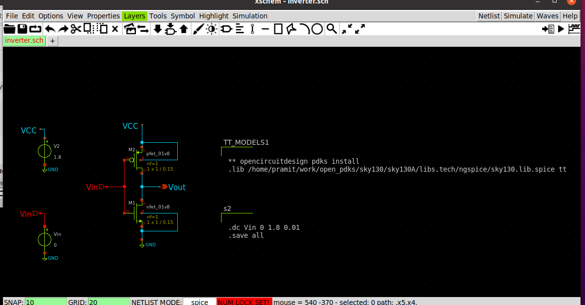


## 3.a Pre-layout Simulation using Xschem and Ngspice

## 3.a.i. DC Analaysis of CMOS inverter
Create the schematic for inverter in Xschem. The TT_MODELS contain the process corner details for PMOS and NMOS. The contents of TT_MODELS will be
```
name= TT_MODELS1
only_toplevel=true
format="tcleval(@value)"
** opencircuitdesign pdks install
.lib /home/pramit/work/open_pdks/sky130/sky130A/libs.tech/ngspice/sky130.lib.spice tt
"
spice_ignore=false
```
DC analysis is done by using the `.dc` command using `code_shown.sym` from components.
```
.dc Vin 0 1.8 0.01
.save all
```
The schematic is as shown.


Click on `Netlist` from the menu to generate a spice file for the schematic created. Then click on `Simulate` to run the simulation and obtain the voltage-transfer characteristic(VTC) for the inverter.

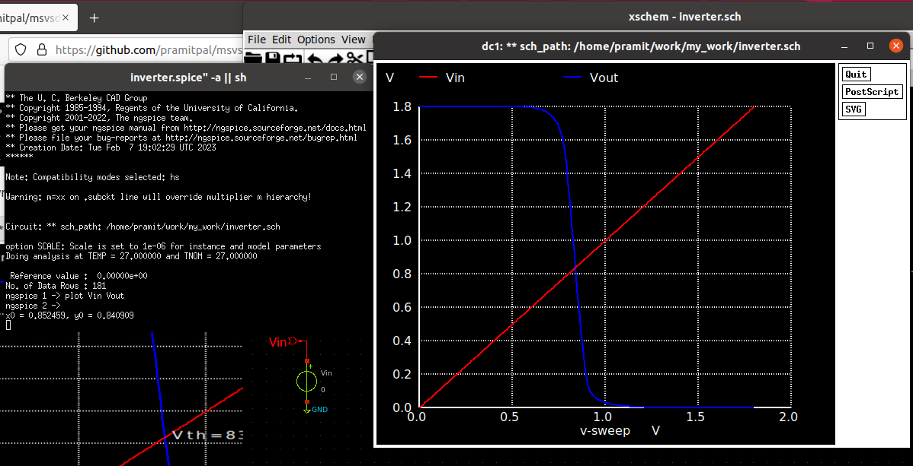

From the VTC, we get the values of the following parameters.

$V_{OL}$= 0 V, $V_{IL}$= 750 mV, $V_{IH}$= 926.2 mV, $V_{OH}$= 1.8 V

The obtained values can be used to calculate noise margins.

NML = $V_{IL}$ - $V_{OL}$= 750 mV


NMH = $V_{OH}$ - $V_{IH}$= 874 mV


## 3.a.ii. Transient Analaysis of CMOS inverter
The transient analysis of the inverter can be obtained by adding `.tran ` in the `code_shown.sym` block.

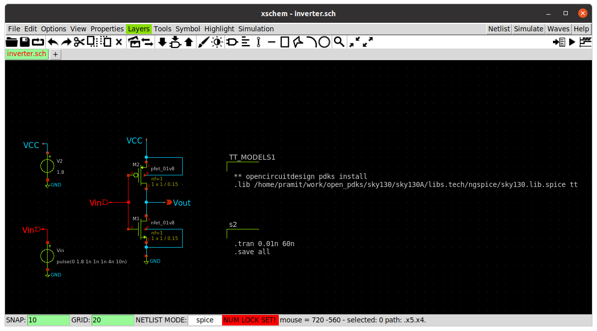
Click on `Netlist` from the menu to generate a spice file for the schematic created. Click on `Simulate` to run the simulation and obtain the out vs time and in vs time.

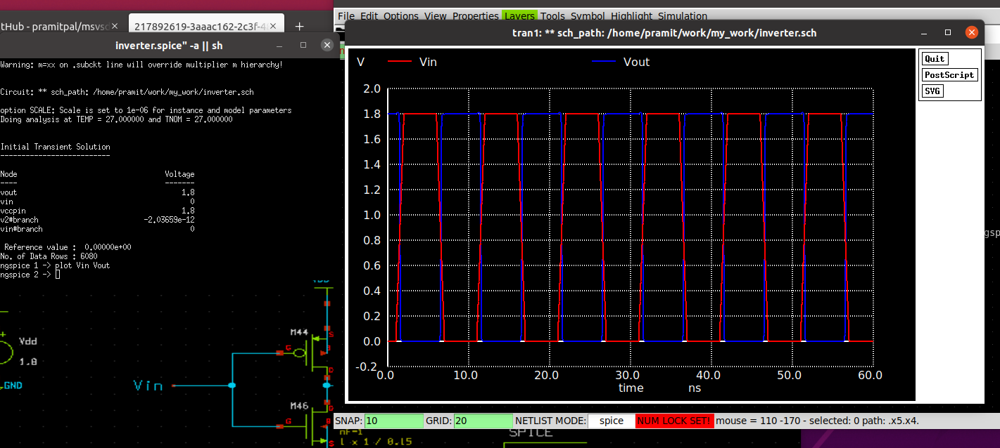
The graph shows the input and output variations with time. Timing parameters can be calculated from the graph below.

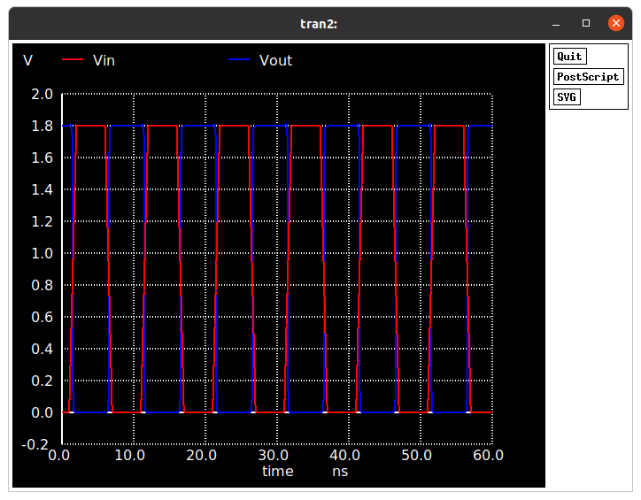

The timing parameters are calculated as

Rise time = **time(@80 % of Vout)** - **time(@20% of Vout)**

Fall time = **time(@20 % of Vout)** - **time(@80% of Vout)**

Cell Rise Delay =**time taken by output to rise to its 50% value** - **time taken by the input to fall to its 50% value**

Cell Fall Delay =**time taken by output to fall to its 50% value** - **time taken by the input to rise to its 50% value**

The timing parameters obtained from pre-layout simulations is tabulated below.

| Parameter    | Value| 
|----------|-----|
|Rise Time|51.85 ps|
|Fall Time|51.85 ps|
|Cell Rise Delay|301.6 ps|
|Cell Fall Delay|379.3 ps|


# 4. Simulation of Inverter using Ngspice

The tech file ['sky130A.tech']() and model file used from [$PDK_ROOT/sky130/sky130A/libs.tech/ngspice/sky130.lib.spice]() has been for simulation of inverter and boolean function in the next section.

## 4.a. Pre-layout Simulation of Inverter using Ngspice
The pre-layout netlist of the inverter for simulation using ngspice.

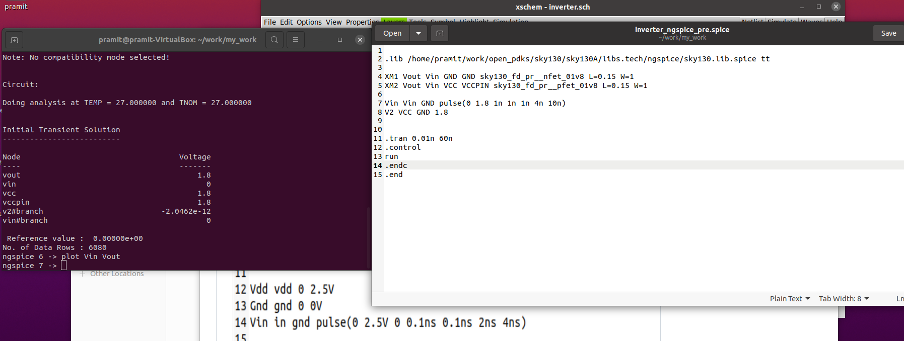

Transient response for pre-layout simulation.


## 4.b. Post-layout Simulation of Inverter using Ngspice
The layout  'inverter_manual.mag' was drawn in Magic as shown using sky130A pdk.

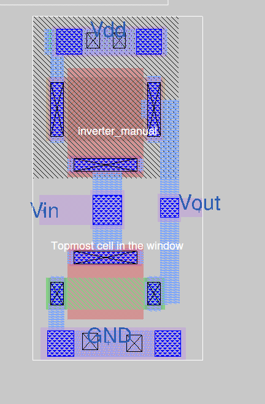

Extracting the netlist from the layout using
```
extract all
ext2spice rthesh 0 cthresh 0
ext2spice
```
Spice file extracted from magic after modifications. 

```
* SPICE3 file created from inverter_manual.ext - technology: sky130A
.lib /home/pramit/work/open_pdks/sky130/sky130A/libs.tech/ngspice/sky130.lib.spice tt
*.subckt inverter_manual Vin Vout Vdd GND
X0 Vout Vin GND GND sky130_fd_pr__nfet_01v8 ad=1.218e+11p pd=1.42e+06u as=1.218e+11p ps=1.42e+06u w=420000u l=1e+06u
X1 Vout Vin Vdd Vdd sky130_fd_pr__pfet_01v8 ad=2.436e+11p pd=2.26e+06u as=2.436e+11p ps=2.26e+06u w=840000u l=1e+06u
C0 Vout Vdd 0.14fF
C1 Vin Vdd 0.42fF
C2 Vout Vin 0.17fF
C3 Vout GND 0.30fF
C4 Vin GND 0.64fF
C5 Vdd GND 0.71fF
*.ends
Vin Vin GND pulse(0 1.8 1n 1n 1n 4n 10n)
V2 Vdd GND 1.8


.tran 0.01n 60n
.control
run
.endc
.end
```

Use `ngspice inverter_manual.spice`and `plot Vout Vin` to get the following plot.

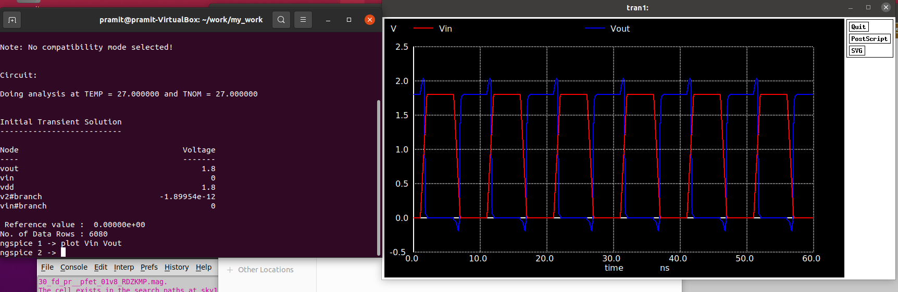

From the transient response it can be clearly seen that due to manual layout, a lot of parasitics have been introduced which are cousing the output waveform to have overshoots and undershoots. By proper placement and routing this can be minimized if not avoided completely.

The timing parameters are calculated as

Rise time = **time(@80 % of Vout)** - **time(@20% of Vout)**

Fall time = **time(@20 % of Vout)** - **time(@80% of Vout)**

Cell Rise Delay =**time taken by output to rise to its 50% value ** - **time taken by the input to fall to its 50% value**

Cell Fall Delay =**time taken by output to fall to its 50% value** - **time taken by the input to rise to its 50% value**

The timing parameters obtained from pre-layout simulations is tabulated below.

| Parameter    | Value| 
|----------|-----|
|Rise Time|125.64 ps|
|Fall Time|91.56 ps|
|Cell Rise Delay|484.88 ps|
|Cell Fall Delay|212.3 ps|

## 4.c. Comparison of Pre-layout and Post-layout timing parameters for inverter.

| Parameter    | Value from Pre-layout Simulation| Value from Post-layout Simulation|
|----------|-----|-----|
|Rise Time|51.85 ps|125.64 ps|
|Fall Time|51.85 ps|91.56 ps|
|Cell Rise Delay|301.6 ps|484.88 ps|
|Cell Fall Delay|379.3 ps|212.3 ps|

From this comparison it can be understood clearly about the importance of good placement and layout of the inverter so that the `timing parameters can be improved further significantly`.


## 4.d LVS Report
The layout vs schematic compares the pre-layout netlist with the netlist extracted from the layout. The mismatch is due to the extra parasitic capacitances in the post-layout netlist. 
However if we manually remove the parasitic capacitances introduced in the extracted netlist then the LVS matches both the spice files uniquely.
The report `comp.out` is obtained using Netgen by typing the following command.
```
netgen -batch lvs inverter_ngspice_pre.spice inverter_manual.spice
```
The content of the report is as shown.

Subcircuit summary:
Circuit 1: inverter_ngspice_pre.spice                   |Circuit 2: inverter_manual.spice
-------------------------------------------|-------------------------------------------
nmos (1)                                   |nmos (1)
pmos (1)                                   |pmos (1)
vsrc (2)                                   |vsrc (2)
Number of devices: 4                       |Number of devices: 4 
Number of nets: 4                          |Number of nets: 4

From `comp.out` file, the net result of the lvs is shown below
```

Circuit 1 cell sky130_fd_pr__nfet_01v8 and Circuit 2 cell sky130_fd_pr__nfet_01v8 are black boxes.
Equate elements:  no current cell.
Device classes sky130_fd_pr__nfet_01v8 and sky130_fd_pr__nfet_01v8 are equivalent.

Circuit 1 cell sky130_fd_pr__pfet_01v8 and Circuit 2 cell sky130_fd_pr__pfet_01v8 are black boxes.
Equate elements:  no current cell.
Device classes sky130_fd_pr__pfet_01v8 and sky130_fd_pr__pfet_01v8 are equivalent.

Subcircuit summary:
Circuit 1: inverter_manual.spice           |Circuit 2: inverter_ngspice_pre.spice      
-------------------------------------------|-------------------------------------------
sky130_fd_pr__nfet_01v8 (1)                |sky130_fd_pr__nfet_01v8 (1)                
sky130_fd_pr__pfet_01v8 (1)                |sky130_fd_pr__pfet_01v8 (1)                
vsrc (2)                                   |vsrc (2)                                   
Number of devices: 4                       |Number of devices: 4                       
Number of nets: 4                          |Number of nets: 4                          
---------------------------------------------------------------------------------------
Netlists match uniquely with property errors.
sky130_fd_pr__pfet_01v8:1 vs. sky130_fd_pr__pfet_01v8:M2:
 l circuit1: 1   circuit2: 0.15   (delta=148%, cutoff=0%)
 w circuit1: 0.84   circuit2: 1   (delta=17.4%, cutoff=0%)
sky130_fd_pr__pfet_01v8:1 vs. sky130_fd_pr__pfet_01v8:M2:
Property ps in circuit1 has no matching property in circuit2
sky130_fd_pr__pfet_01v8:1 vs. sky130_fd_pr__pfet_01v8:M2:
Property as in circuit1 has no matching property in circuit2
sky130_fd_pr__pfet_01v8:1 vs. sky130_fd_pr__pfet_01v8:M2:
Property pd in circuit1 has no matching property in circuit2
sky130_fd_pr__pfet_01v8:1 vs. sky130_fd_pr__pfet_01v8:M2:
Property ad in circuit1 has no matching property in circuit2
sky130_fd_pr__nfet_01v8:0 vs. sky130_fd_pr__nfet_01v8:M1:
 l circuit1: 1   circuit2: 0.15   (delta=148%, cutoff=0%)
 w circuit1: 0.42   circuit2: 1   (delta=81.7%, cutoff=0%)
sky130_fd_pr__nfet_01v8:0 vs. sky130_fd_pr__nfet_01v8:M1:
Property ps in circuit1 has no matching property in circuit2
sky130_fd_pr__nfet_01v8:0 vs. sky130_fd_pr__nfet_01v8:M1:
Property as in circuit1 has no matching property in circuit2
sky130_fd_pr__nfet_01v8:0 vs. sky130_fd_pr__nfet_01v8:M1:
Property pd in circuit1 has no matching property in circuit2
sky130_fd_pr__nfet_01v8:0 vs. sky130_fd_pr__nfet_01v8:M1:
Property ad in circuit1 has no matching property in circuit2
Cells have no pins;  pin matching not needed.
Device classes inverter_manual.spice and inverter_ngspice_pre.spice are equivalent.

Final result: Circuits match uniquely.
Property errors were found.

The following cells had property errors:
 inverter_manual.spice
```
It can be seen that there are some property errors present in `inverter_manual.spice` file, which is postlayout, extracted netlist.
Next step can be to prevent the property error arising in the post layout netlist.
# WEEK 2
# 5. Generating Inverter Layout using ALIGN
Generating Inverter Layout for the following netlist using ALIGN.
```
.subckt inverter vin vout vdd vss
XM2 vout vin vss vss sky130_fd_pr__nfet_01v8 L=150n W=420n nf=2
XM3 vout vin vdd vdd sky130_fd_pr__pfet_01v8 L=150n W=840n nf=2
.ends
```
To generate the layout run the following command
```
schematic2layout.py ~/inverter/ -p ../pdks/SKY130_PDK/
```
# 5a. Generated Layout using ALIGN
The following layout is generated as a .gds file.
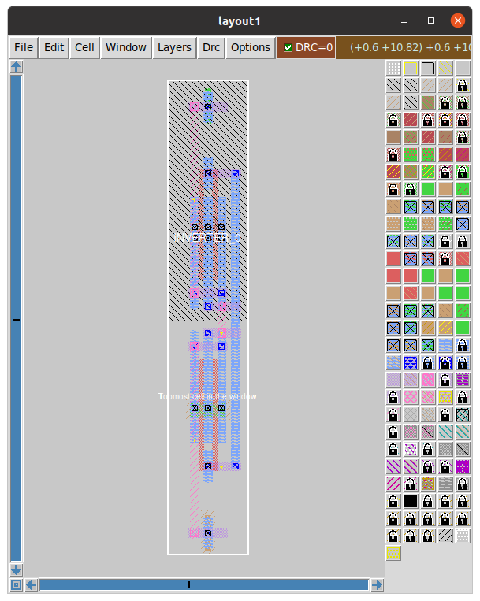
# 5b. Extracted netlist from magic
After extracting the netlist from magic and adding library files and run commands to the spice netlist we have
```
* SPICE3 file created from INVERTER_0.ext - technology: sky130A

.subckt INVERTER_0 VIN VSS VOUT VDD
X0 VOUT VIN VDD VDD sky130_fd_pr__pfet_01v8 ad=2.352e+11p pd=2.24e+06u as=4.452e+11p ps=4.42e+06u w=840000u l=150000u
X1 VDD VIN VOUT VDD sky130_fd_pr__pfet_01v8 ad=0p pd=0u as=0p ps=0u w=840000u l=150000u
X2 VOUT VIN VSS VSS sky130_fd_pr__nfet_01v8 ad=1.176e+11p pd=1.4e+06u as=2.226e+11p ps=2.74e+06u w=420000u l=150000u
X3 VSS VIN VOUT VSS sky130_fd_pr__nfet_01v8 ad=0p pd=0u as=0p ps=0u w=420000u l=150000u
C0 VDD VSS 3.02fF
.ends

*=======Added manually========
X1 in GND out VDD INVERTER_0
V1 VDD GND 1.8
.save i(net1)
V2 in GND pulse(0 1.8 1n 1n 1n 4n 10n)
.save i(in)
**** begin user architecture code

.lib /home/pramit/work/open_pdks/sources/sky130-pdk/libraries/sky130_fd_pr/latest/models/sky130.lib.spice tt

.control
save all
tran 1n 20n
plot v(in) v(out)
.endc

```
# 5c. Simulation of the netlist using NGSPICE
Running simulation using ngspice
``` 
ngspice INVERTER_0.spice
```
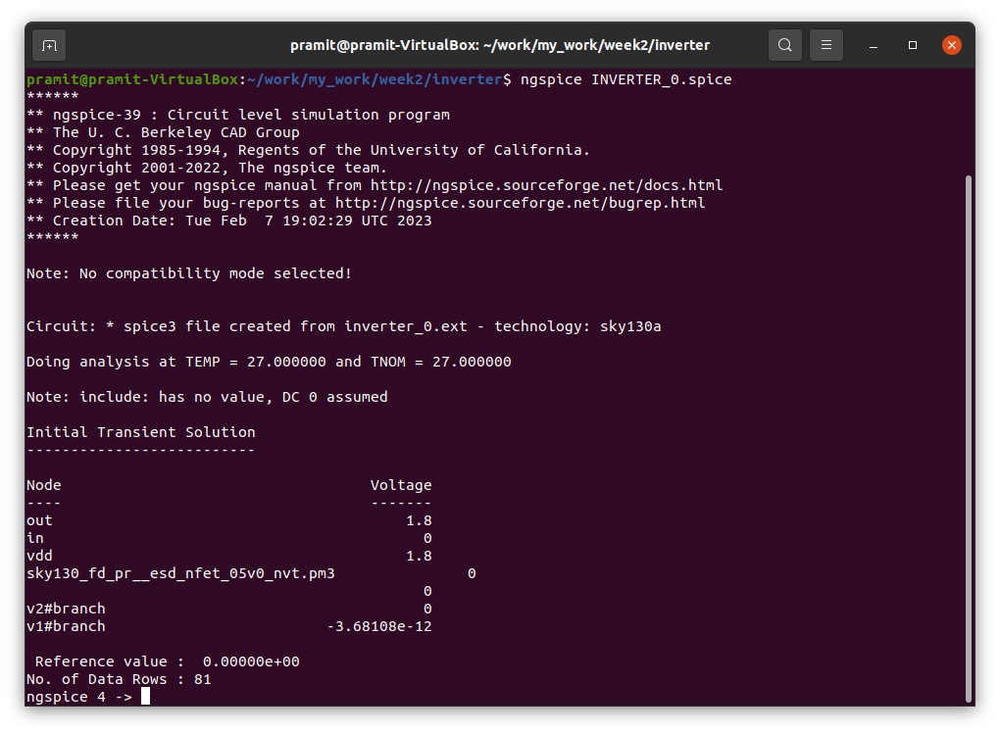
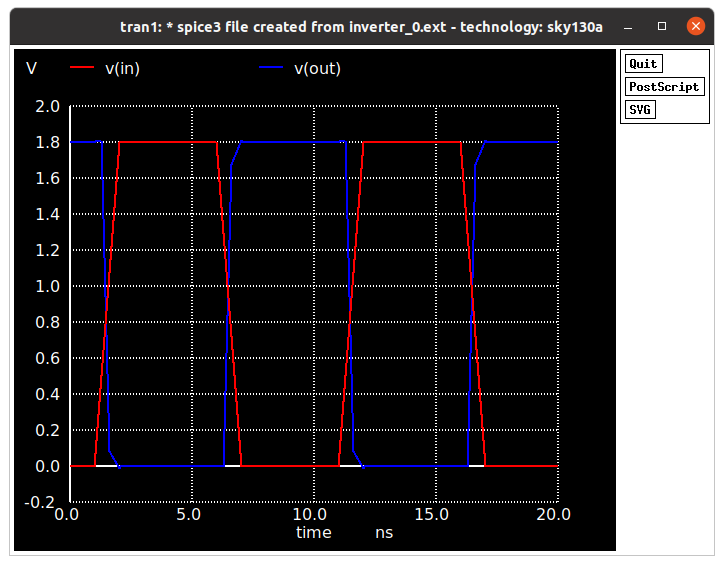

The figure above shows the output waveform for the netlist generated using ALIGN of the inverter.
# 6 Prelayout and Postlayout simulation of a function Fn = [(B+D).(A+C)+E.F]'
For prelayout simulation of the function Fn we use Xschem and Ngspice and SKY130A pdk.
# 6a. Drawing the schematic for Fn in xschem
Drawing the schematic in Xschem


After extracting the netlist from xschem we get 
```
** sch_path: /home/pramit/work/my_work/week1/function.sch
**.subckt function A B D F E C A B C D F E Fn A B C D E F
*.ipin A
*.ipin B
*.ipin D
*.ipin F
*.ipin E
*.ipin C
*.ipin A
*.ipin B
*.ipin C
*.ipin D
*.ipin F
*.ipin E
*.opin Fn
*.ipin A
*.ipin B
*.ipin C
*.ipin D
*.ipin E
*.ipin F
XM1 net1 A VDD VDD sky130_fd_pr__pfet_01v8 L=0.15 W=1 nf=1 ad='int((nf+1)/2) * W/nf * 0.29' as='int((nf+2)/2) * W/nf * 0.29'
+ pd='2*int((nf+1)/2) * (W/nf + 0.29)' ps='2*int((nf+2)/2) * (W/nf + 0.29)' nrd='0.29 / W' nrs='0.29 / W'
+ sa=0 sb=0 sd=0 mult=1 m=1
XM2 Fn A net4 net4 sky130_fd_pr__nfet_01v8 L=0.15 W=1 nf=1 ad='int((nf+1)/2) * W/nf * 0.29' as='int((nf+2)/2) * W/nf * 0.29'
+ pd='2*int((nf+1)/2) * (W/nf + 0.29)' ps='2*int((nf+2)/2) * (W/nf + 0.29)' nrd='0.29 / W' nrs='0.29 / W'
+ sa=0 sb=0 sd=0 mult=1 m=1
XM3 net3 B VDD VDD sky130_fd_pr__pfet_01v8 L=0.15 W=1 nf=1 ad='int((nf+1)/2) * W/nf * 0.29' as='int((nf+2)/2) * W/nf * 0.29'
+ pd='2*int((nf+1)/2) * (W/nf + 0.29)' ps='2*int((nf+2)/2) * (W/nf + 0.29)' nrd='0.29 / W' nrs='0.29 / W'
+ sa=0 sb=0 sd=0 mult=1 m=1
XM4 net2 C net1 net1 sky130_fd_pr__pfet_01v8 L=0.15 W=1 nf=1 ad='int((nf+1)/2) * W/nf * 0.29' as='int((nf+2)/2) * W/nf * 0.29'
+ pd='2*int((nf+1)/2) * (W/nf + 0.29)' ps='2*int((nf+2)/2) * (W/nf + 0.29)' nrd='0.29 / W' nrs='0.29 / W'
+ sa=0 sb=0 sd=0 mult=1 m=1
XM5 net2 D net3 net3 sky130_fd_pr__pfet_01v8 L=0.15 W=1 nf=1 ad='int((nf+1)/2) * W/nf * 0.29' as='int((nf+2)/2) * W/nf * 0.29'
+ pd='2*int((nf+1)/2) * (W/nf + 0.29)' ps='2*int((nf+2)/2) * (W/nf + 0.29)' nrd='0.29 / W' nrs='0.29 / W'
+ sa=0 sb=0 sd=0 mult=1 m=1
XM6 Fn E net2 net2 sky130_fd_pr__pfet_01v8 L=0.15 W=1 nf=1 ad='int((nf+1)/2) * W/nf * 0.29' as='int((nf+2)/2) * W/nf * 0.29'
+ pd='2*int((nf+1)/2) * (W/nf + 0.29)' ps='2*int((nf+2)/2) * (W/nf + 0.29)' nrd='0.29 / W' nrs='0.29 / W'
+ sa=0 sb=0 sd=0 mult=1 m=1
XM7 Fn F net2 net2 sky130_fd_pr__pfet_01v8 L=0.15 W=1 nf=1 ad='int((nf+1)/2) * W/nf * 0.29' as='int((nf+2)/2) * W/nf * 0.29'
+ pd='2*int((nf+1)/2) * (W/nf + 0.29)' ps='2*int((nf+2)/2) * (W/nf + 0.29)' nrd='0.29 / W' nrs='0.29 / W'
+ sa=0 sb=0 sd=0 mult=1 m=1
XM8 Fn C net4 net4 sky130_fd_pr__nfet_01v8 L=0.15 W=1 nf=1 ad='int((nf+1)/2) * W/nf * 0.29' as='int((nf+2)/2) * W/nf * 0.29'
+ pd='2*int((nf+1)/2) * (W/nf + 0.29)' ps='2*int((nf+2)/2) * (W/nf + 0.29)' nrd='0.29 / W' nrs='0.29 / W'
+ sa=0 sb=0 sd=0 mult=1 m=1
XM9 net4 B GND GND sky130_fd_pr__nfet_01v8 L=0.15 W=1 nf=1 ad='int((nf+1)/2) * W/nf * 0.29' as='int((nf+2)/2) * W/nf * 0.29'
+ pd='2*int((nf+1)/2) * (W/nf + 0.29)' ps='2*int((nf+2)/2) * (W/nf + 0.29)' nrd='0.29 / W' nrs='0.29 / W'
+ sa=0 sb=0 sd=0 mult=1 m=1
XM10 net4 D GND GND sky130_fd_pr__nfet_01v8 L=0.15 W=1 nf=1 ad='int((nf+1)/2) * W/nf * 0.29' as='int((nf+2)/2) * W/nf * 0.29'
+ pd='2*int((nf+1)/2) * (W/nf + 0.29)' ps='2*int((nf+2)/2) * (W/nf + 0.29)' nrd='0.29 / W' nrs='0.29 / W'
+ sa=0 sb=0 sd=0 mult=1 m=1
XM11 Fn E net5 net5 sky130_fd_pr__nfet_01v8 L=0.15 W=1 nf=1 ad='int((nf+1)/2) * W/nf * 0.29' as='int((nf+2)/2) * W/nf * 0.29'
+ pd='2*int((nf+1)/2) * (W/nf + 0.29)' ps='2*int((nf+2)/2) * (W/nf + 0.29)' nrd='0.29 / W' nrs='0.29 / W'
+ sa=0 sb=0 sd=0 mult=1 m=1
XM12 net5 F GND GND sky130_fd_pr__nfet_01v8 L=0.15 W=1 nf=1 ad='int((nf+1)/2) * W/nf * 0.29' as='int((nf+2)/2) * W/nf * 0.29'
+ pd='2*int((nf+1)/2) * (W/nf + 0.29)' ps='2*int((nf+2)/2) * (W/nf + 0.29)' nrd='0.29 / W' nrs='0.29 / W'
+ sa=0 sb=0 sd=0 mult=1 m=1
V1 VDD GND 3
.save i(v1)
V2 A GND pulse(0 3 0.1n 10p 10p 1n 2n)
.save i(v2)
V3 B GND pulse(0 3 0.2n 10p 10p 1n 2n)1.8
.save i(v3)
V4 C GND pulse(0 3 0.3n 10p 10p 1n 2n)1.8
.save i(v4)
V5 D GND pulse(0 3 0.4n 10p 10p 1n 2n)1.8
.save i(v5)
V6 E GND pulse(0 3 0.5n 10p 10p 1n 2n)1.8
.save i(v6)
V7 F GND pulse(0 3 0.6n 10p 10p 1n 2n)1.8
.save i(v7)
**** begin user architecture code


** opencircuitdesign pdks install
.lib /home/pramit/work/open_pdks/sky130/sky130A/libs.tech/ngspice/sky130.lib.spice tt


.tran 0.01n 5n
.save all
.control
run
plot A B C D E F Fn
.endc


**** end user architecture code
**.ends
.GLOBAL VDD
.GLOBAL GND
.end

```
# 6b. Prelayout simulation using ngspice (function_new.sp)
Simulating using ngspice gives us the following output for Fn.
``` 
ngspice function_new.sp
```
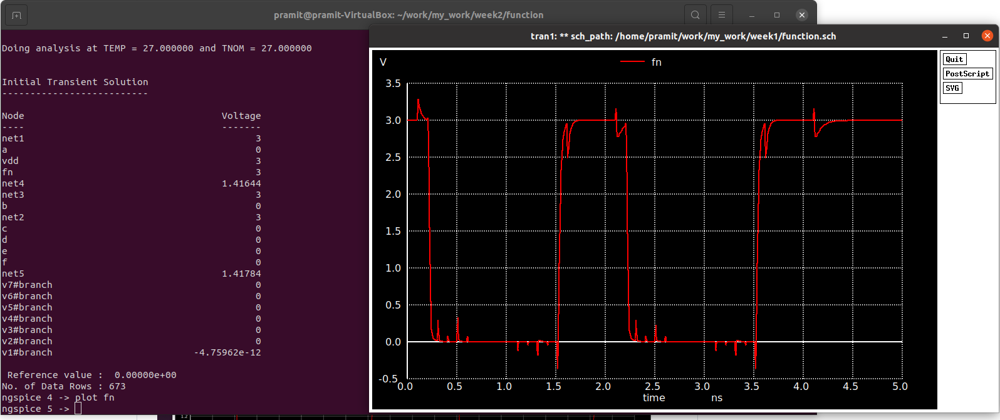

# 6c. Postlayout simulation of Fn using Magic (Manual Layout)
The image below shows the layout of the Function done manually using Magic and sky130 pdk.
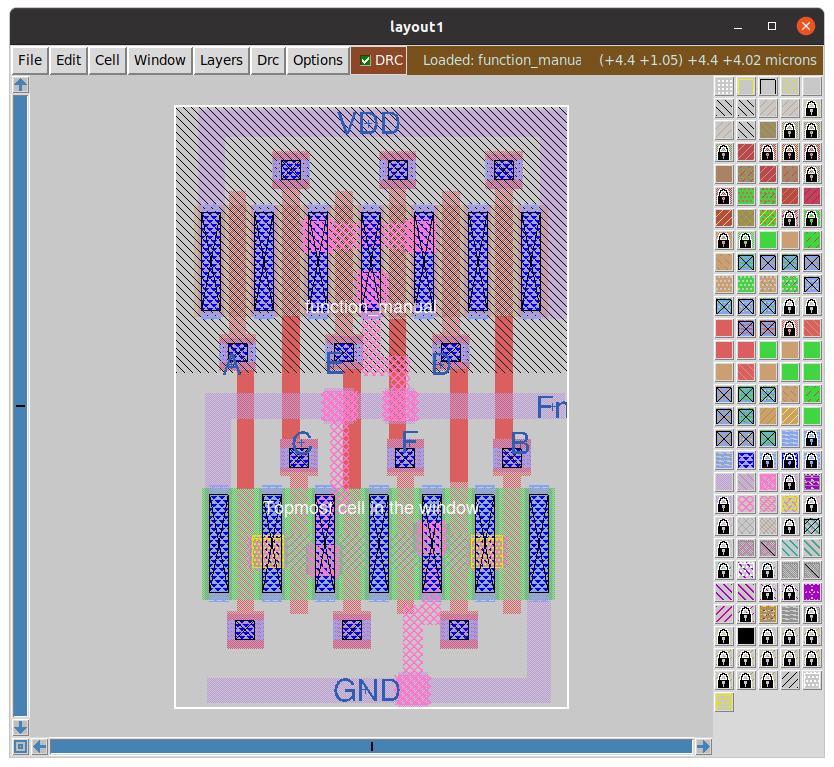

Simulating the extracted netlist using ngspice after extracting from magic using the commands.
```
extract all
ext2spice hierarchy off
ext2spice scale off
ext2spice cthresh 0 rthresh 0
ext2spice
```
The extracted netlist after adding all run commands and .lib files.
```
* SPICE3 file created from function_manual.ext - technology: sky130A

.subckt function_manual Fn VDD GND B D F E C A
X0 m1_134_n340# A Fn VSUBS sky130_fd_pr__nfet_01v8 ad=6.6e+11p pd=5.32e+06u as=6.4e+11p ps=5.28e+06u w=1e+06u l=150000u
X1 Fn C m1_134_n340# VSUBS sky130_fd_pr__nfet_01v8 ad=0p pd=0u as=0p ps=0u w=1e+06u l=150000u
X2 GND F sky130_fd_pr__nfet_01v8_USBP4X_0/a_n33_n100# VSUBS sky130_fd_pr__nfet_01v8 ad=6.4e+11p pd=5.28e+06u as=3.3e+11p ps=2.66e+06u w=1e+06u l=150000u
X3 sky130_fd_pr__nfet_01v8_USBP4X_0/a_n33_n100# E Fn VSUBS sky130_fd_pr__nfet_01v8 ad=0p pd=0u as=0p ps=0u w=1e+06u l=150000u
X4 m1_134_n340# D GND VSUBS sky130_fd_pr__nfet_01v8 ad=0p pd=0u as=0p ps=0u w=1e+06u l=150000u
X5 GND B m1_134_n340# VSUBS sky130_fd_pr__nfet_01v8 ad=0p pd=0u as=0p ps=0u w=1e+06u l=150000u
X6 m1_226_230# F Fn w_0_10# sky130_fd_pr__pfet_01v8 ad=6.6e+11p pd=5.32e+06u as=3.3e+11p ps=2.66e+06u w=1e+06u l=150000u
X7 Fn E m1_226_230# w_0_10# sky130_fd_pr__pfet_01v8 ad=0p pd=0u as=0p ps=0u w=1e+06u l=150000u
X8 VDD B sky130_fd_pr__pfet_01v8_2XYSGK_0/a_159_n100# w_0_10# sky130_fd_pr__pfet_01v8 ad=6.2e+11p pd=5.24e+06u as=3.3e+11p ps=2.66e+06u w=1e+06u l=150000u
X9 sky130_fd_pr__pfet_01v8_2XYSGK_0/a_159_n100# D m1_226_230# w_0_10# sky130_fd_pr__pfet_01v8 ad=0p pd=0u as=0p ps=0u w=1e+06u l=150000u
X10 sky130_fd_pr__pfet_01v8_2XYSGK_0/a_n225_n100# A VDD w_0_10# sky130_fd_pr__pfet_01v8 ad=3.3e+11p pd=2.66e+06u as=0p ps=0u w=1e+06u l=150000u
X11 m1_226_230# C sky130_fd_pr__pfet_01v8_2XYSGK_0/a_n225_n100# w_0_10# sky130_fd_pr__pfet_01v8 ad=0p pd=0u as=0p ps=0u w=1e+06u l=150000u
C0 m1_134_n340# w_0_10# 0.01fF
C1 w_0_10# sky130_fd_pr__pfet_01v8_2XYSGK_0/a_159_n100# 0.01fF
C2 m1_226_230# sky130_fd_pr__nfet_01v8_USBP4X_0/a_n33_n100# 0.00fF
C3 GND B 0.03fF
C4 A w_0_10# 0.09fF
C5 w_0_10# D 0.08fF
C6 sky130_fd_pr__pfet_01v8_2XYSGK_0/a_n225_n100# C 0.02fF
C7 GND VDD 0.00fF
C8 F E 0.11fF
C9 GND w_0_10# 0.00fF
C10 m1_134_n340# Fn 0.44fF
C11 B E 0.00fF
C12 sky130_fd_pr__pfet_01v8_2XYSGK_0/a_159_n100# Fn 0.01fF
C13 A Fn 0.11fF
C14 D Fn 0.09fF
C15 VDD E 0.01fF
C16 m1_134_n340# sky130_fd_pr__nfet_01v8_USBP4X_0/a_n33_n100# 0.01fF
C17 m1_226_230# C 0.02fF
C18 w_0_10# E 0.08fF
C19 F B 0.05fF
C20 GND Fn 0.08fF
C21 F VDD 0.06fF
C22 GND sky130_fd_pr__nfet_01v8_USBP4X_0/a_n33_n100# 0.17fF
C23 w_0_10# F 0.15fF
C24 B VDD 0.10fF
C25 Fn E 0.12fF
C26 m1_134_n340# C 0.03fF
C27 A C 0.10fF
C28 D C 0.00fF
C29 w_0_10# B 0.14fF
C30 sky130_fd_pr__nfet_01v8_USBP4X_0/a_n33_n100# E 0.02fF
C31 w_0_10# VDD 0.42fF
C32 m1_226_230# sky130_fd_pr__pfet_01v8_2XYSGK_0/a_n225_n100# 0.15fF
C33 F Fn 0.10fF
C34 GND C 0.01fF
C35 F sky130_fd_pr__nfet_01v8_USBP4X_0/a_n33_n100# 0.02fF
C36 B Fn 0.08fF
C37 VDD Fn 0.05fF
C38 C E 0.09fF
C39 w_0_10# Fn 0.08fF
C40 m1_134_n340# sky130_fd_pr__pfet_01v8_2XYSGK_0/a_n225_n100# 0.01fF
C41 A sky130_fd_pr__pfet_01v8_2XYSGK_0/a_n225_n100# 0.01fF
C42 w_0_10# sky130_fd_pr__nfet_01v8_USBP4X_0/a_n33_n100# 0.00fF
C43 F C 0.05fF
C44 m1_134_n340# m1_226_230# 0.00fF
C45 m1_226_230# sky130_fd_pr__pfet_01v8_2XYSGK_0/a_159_n100# 0.15fF
C46 sky130_fd_pr__nfet_01v8_USBP4X_0/a_n33_n100# Fn 0.18fF
C47 VDD C 0.08fF
C48 A m1_226_230# 0.00fF
C49 D m1_226_230# 0.02fF
C50 w_0_10# C 0.15fF
C51 GND m1_226_230# 0.01fF
C52 m1_134_n340# sky130_fd_pr__pfet_01v8_2XYSGK_0/a_159_n100# 0.01fF
C53 m1_134_n340# A 0.03fF
C54 m1_134_n340# D 0.04fF
C55 Fn C 0.14fF
C56 D sky130_fd_pr__pfet_01v8_2XYSGK_0/a_159_n100# 0.01fF
C57 A D 0.00fF
C58 m1_226_230# E 0.03fF
C59 m1_134_n340# GND 0.43fF
C60 VDD sky130_fd_pr__pfet_01v8_2XYSGK_0/a_n225_n100# 0.16fF
C61 GND A 0.04fF
C62 GND D 0.10fF
C63 F m1_226_230# 0.04fF
C64 w_0_10# sky130_fd_pr__pfet_01v8_2XYSGK_0/a_n225_n100# 0.01fF
C65 m1_134_n340# E 0.01fF
C66 B m1_226_230# 0.00fF
C67 A E 0.05fF
C68 D E 0.05fF
C69 m1_226_230# VDD 0.04fF
C70 Fn sky130_fd_pr__pfet_01v8_2XYSGK_0/a_n225_n100# 0.01fF
C71 w_0_10# m1_226_230# 0.04fF
C72 m1_134_n340# F 0.01fF
C73 GND E 0.05fF
C74 A F 0.00fF
C75 D F 0.09fF
C76 m1_134_n340# B 0.03fF
C77 B sky130_fd_pr__pfet_01v8_2XYSGK_0/a_159_n100# 0.02fF
C78 A B 0.00fF
C79 D B 0.11fF
C80 m1_134_n340# VDD 0.00fF
C81 GND F 0.04fF
C82 VDD sky130_fd_pr__pfet_01v8_2XYSGK_0/a_159_n100# 0.16fF
C83 m1_226_230# Fn 0.44fF
C84 A VDD 0.02fF
C85 D VDD 0.01fF
C86 D VSUBS 0.10fF
C87 E VSUBS 0.06fF
C88 A VSUBS 0.19fF
C89 B VSUBS 0.15fF
C90 F VSUBS 0.01fF
C91 C VSUBS 0.04fF
C92 sky130_fd_pr__pfet_01v8_2XYSGK_0/a_159_n100# VSUBS 0.00fF  
C93 sky130_fd_pr__pfet_01v8_2XYSGK_0/a_n225_n100# VSUBS 0.00fF  
C94 w_0_10# VSUBS 1.02fF  
C95 GND VSUBS 0.09fF
C96 sky130_fd_pr__nfet_01v8_USBP4X_0/a_n33_n100# VSUBS 0.01fF  
C97 m1_134_n340# VSUBS 0.20fF  
.ends

X1 Fn VDD GND Vb Vd Vf Ve Vc Va function_manual


Vdd1 Va GND pulse(0 1.8 0.1n 10p 10p 1n 2n)

Vdd2 Vb GND pulse(0 1.8 0.2n 10p 10p 1n 2n)

Vdd3 Vc GND pulse(0 1.8 0.3n 10p 10p 1n 2n)

Vdd4 Vd GND pulse(0 1.8 0.4n 10p 10p 1n 2n)

Vdd5 Ve GND pulse(0 1.8 0.5n 10p 10p 1n 2n)

Vdd6 Vf GND pulse(0 1.8 0.6n 10p 10p 1n 2n)

VDD VDD GND 1.8
**** begin user architecture code
.lib /home/pramit/work/open_pdks/sky130/sky130A/libs.tech/ngspice/sky130.lib.spice tt

.save all
.control
save all
tran 1n 5n
plot Va Vb Vc Vd Ve Vf
plot Fn
.endc

```
Post layout simulation waveform using ngspice.
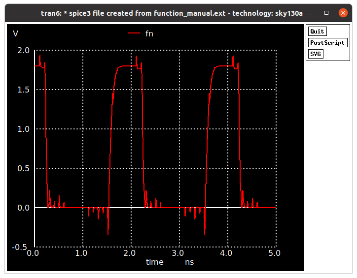
# 6d. Postlayout simulation of Fn using ALIGN
To generate the layout of the Function We use the following netlist
```
.subckt function A B C D E F VN VP Y
XM1 Y E net2 VP sky130_fd_pr__pfet_01v8 L=180n W=420n nf=2
XM2 Y F net2 VP sky130_fd_pr__pfet_01v8 L=180n W=420n nf=2
XM3 net2 C net1 VP sky130_fd_pr__pfet_01v8 L=180n W=420n nf=2
XM4 net2 D net3 VP sky130_fd_pr__pfet_01v8 L=180n W=420n nf=2
XM5 net1 A VP VP sky130_fd_pr__pfet_01v8 L=180n W=420n nf=2
XM6 net3 B VP VP sky130_fd_pr__pfet_01v8 L=180n W=420n nf=2
XM7 Y A net5 net5 sky130_fd_pr__nfet_01v8 L=180n W=420n nf=2
XM8 net5 B VN VN sky130_fd_pr__nfet_01v8 L=180n W=420n nf=2
XM9 Y C net5 VN sky130_fd_pr__nfet_01v8 L=180n W=420n nf=2
XM10 net5 D VN VN sky130_fd_pr__nfet_01v8 L=180n W=420n nf=2
XM11 Y E net4 VN sky130_fd_pr__nfet_01v8 L=180n W=420n nf=2
XM12 net4 F VN VN sky130_fd_pr__nfet_01v8 L=180n W=420n nf=2
.ends
```

Generating the layout of Fn using ALIGN using the following command
```
schematic2layout.py ~/function/ -p ../pdks/SKY130_PDK/
```
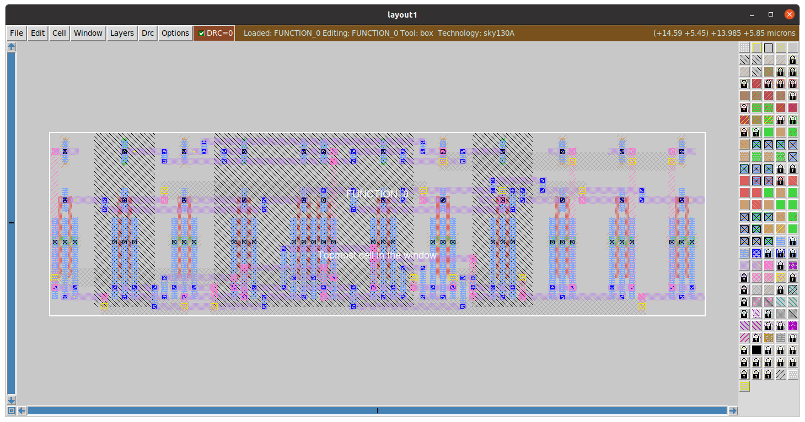
``` 
extract all 
ext2spice scale off
ext2spice hierarchy off
ext2spice cthresh 0 rthresh 0
ext2spice
```
After running these commands we get the extracted netlist from magic tool. We then add control commands to the netlist to run the spice simulation.
```
* SPICE3 file created from FUNCTION_0.ext - technology: sky130A

.option scale=5000u

.subckt FUNCTION_0 A B VP D VN F Y E C
X0 Y li_3157_907# li_1093_67# VP sky130_fd_pr__pfet_01v8 ad=9408 pd=560 as=27216 ps=1656 w=84 l=30
X1 li_1093_67# li_3157_907# Y VP sky130_fd_pr__pfet_01v8 ad=0 pd=0 as=0 ps=0 w=84 l=30
X2 Y E li_1093_67# VP sky130_fd_pr__pfet_01v8 ad=0 pd=0 as=0 ps=0 w=84 l=30
X3 li_1093_67# E Y VP sky130_fd_pr__pfet_01v8 ad=0 pd=0 as=0 ps=0 w=84 l=30
X4 Y m1_946_896# VN VN sky130_fd_pr__nfet_01v8 ad=14112 pd=840 as=53928 ps=3300 w=84 l=30
X5 VN m1_946_896# Y VN sky130_fd_pr__nfet_01v8 ad=0 pd=0 as=0 ps=0 w=84 l=30
X6 Y E m1_1376_140# VN sky130_fd_pr__nfet_01v8 ad=0 pd=0 as=13608 ps=828 w=84 l=30
X7 m1_1376_140# E Y VN sky130_fd_pr__nfet_01v8 ad=0 pd=0 as=0 ps=0 w=84 l=30
X8 VN li_2727_823# VN VN sky130_fd_pr__nfet_01v8 ad=0 pd=0 as=0 ps=0 w=84 l=30
X9 VN li_2727_823# VN VN sky130_fd_pr__nfet_01v8 ad=0 pd=0 as=0 ps=0 w=84 l=30
X10 Y A VN VN sky130_fd_pr__nfet_01v8 ad=0 pd=0 as=0 ps=0 w=84 l=30
X11 VN A Y VN sky130_fd_pr__nfet_01v8 ad=0 pd=0 as=0 ps=0 w=84 l=30
X12 m1_1376_140# li_3157_907# VN VN sky130_fd_pr__nfet_01v8 ad=0 pd=0 as=0 ps=0 w=84 l=30
X13 VN li_3157_907# m1_1376_140# VN sky130_fd_pr__nfet_01v8 ad=0 pd=0 as=0 ps=0 w=84 l=30
X14 VN D VN VN sky130_fd_pr__nfet_01v8 ad=0 pd=0 as=0 ps=0 w=84 l=30
X15 VN D VN VN sky130_fd_pr__nfet_01v8 ad=0 pd=0 as=0 ps=0 w=84 l=30
X16 li_1093_67# D li_2727_n17# VP sky130_fd_pr__pfet_01v8 ad=0 pd=0 as=13608 ps=828 w=84 l=30
X17 li_2727_n17# D li_1093_67# VP sky130_fd_pr__pfet_01v8 ad=0 pd=0 as=0 ps=0 w=84 l=30
X18 VP li_2727_823# li_2727_n17# VP sky130_fd_pr__pfet_01v8 ad=13608 pd=828 as=0 ps=0 w=84 l=30
X19 li_1007_n17# A VP VP sky130_fd_pr__pfet_01v8 ad=13608 pd=828 as=0 ps=0 w=84 l=30
X20 VP A li_1007_n17# VP sky130_fd_pr__pfet_01v8 ad=0 pd=0 as=0 ps=0 w=84 l=30
X21 li_2727_n17# li_2727_823# VP VP sky130_fd_pr__pfet_01v8 ad=0 pd=0 as=0 ps=0 w=84 l=30
X22 li_1093_67# m1_946_896# li_1007_n17# VP sky130_fd_pr__pfet_01v8 ad=0 pd=0 as=0 ps=0 w=84 l=30
X23 li_1007_n17# m1_946_896# li_1093_67# VP sky130_fd_pr__pfet_01v8 ad=0 pd=0 as=0 ps=0 w=84 l=30
C0 VP li_1093_67# 2.09fF
C1 Y li_1093_67# 2.48fF
C2 Y VN 2.15fF
C3 m1_946_896# VN 2.08fF **FLOATING
C4 VP VN 13.16fF
C5 D VN 2.26fF
C6 m1_1376_140# VN 2.62fF **FLOATING
.ends

X1 Va Vb VDD Vd GND Vf Fn Ve Vc FUNCTION_0
Va Va GND pulse 0 1.8 10ns 1ns 1ns 5ns 10ns
Vb Vb GND pulse 0 1.8 10ns 2ns 2ns 10ns 20ns
Vc Vc GND pulse 0 1.8 10ns 4ns 4ns 20ns 40ns
Vd Vd GND pulse 0 1.8 10ns 8ns 8ns 40ns 80ns
Ve Ve GND pulse 0 1.8 10ns 16ns 16ns 80ns 160ns
Vf Vf GND pulse 0 1.8 10ns 32ns 32ns 160ns 320ns
VDD VDD GND 1.8
**** begin user architecture code
.lib /home/pramit/work/open_pdks/sky130/sky130A/libs.tech/ngspice/sky130.lib.spice tt

.tran 0.5n 1u
.save all
```
The postlayout simulation after running ALIGN is given in the figure below.
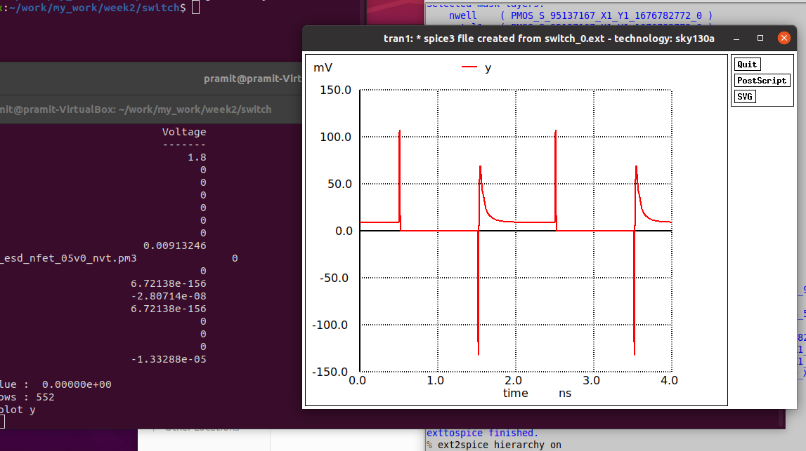

The output waveform after being simulated seems incorrect. Further investigation is required to sort as to what is causing this unexpected output waveform.(Suspecting incorrect placement or maybe some floating pins).
# 6e. Issues while using ALIGN
One of the most common issue faced with align is that if in any line of the netlist given as input, there exists a space after a mosfet declaration then ALIGN considers it as an incorrect parameter and throws an error.

This can be easily solved by checking for spaces at the end of each statement, if any, they must be removed before moving on with the flow.

The ``w`` parameter of a mosfet must be a multiple of 210nm which is built into the algortihm of ALIGN. 

Furthermore ``nf`` of number of fins must be greater than or equal to 2. 
Despite carefully checking for all these errors manually before layout generation the algorithm still fails to generate the correct .gds files sometimes with large designs.

This could be an investigation for future works, as to what json inputs affect the routing and placement of each cells in the final layout.
# WEEK 3
# 7. Setting Up OpenFasoc
Before installing OpenFasoc we need to setup few tools which are prerequisite for OpenFasoc.Some of the tools have already been installed and few are pending.
The dependendencies that are required to install OpenFASoC are always changing, so it is best to follow the related sources. Use the corresponding source that the following table provides. These dependencies can also be installed using the dependency script provided with OpenFASoC repo.

|  Dependencies | Version (21 Feb 2023) |             Note                    |        Status|
|:-------------:|:----------------------:|:-----------------------------------:|:-----------:|
| [Magic](https://github.com/RTimothyEdwards/magic)  |8.3.356| [opencircuitdesign.com](http://opencircuitdesign.com/magic/index.html)| &check; |
| [Netgen](https://github.com/RTimothyEdwards/netgen)|1.5.244|[opencircuitdesign.com](http://opencircuitdesign.com/netgen/index.html)|&check;|
| [Klayout](https://github.com/KLayout/klayout)|0.28.2-1|If error, install the **.deb** from [klayout.de](https://www.klayout.de/build.html)|&check;|
| [Yosys](https://github.com/The-OpenROAD-Project/yosys)|0.23+3|After install, **cd** into **/usr/bin** and do: **sudo ln -s /home/user/yosys-dir/yosys yosys**|&cross;|
| [OpenROAD](https://github.com/The-OpenROAD-Project/OpenROAD)|2.0_6760|After install, **cd** into **/usr/bin** and do: **sudo ln -s /home/user/OpenROAD-dir/build/src/openroad openroad**|&cross;|
| [Open_pdks](https://github.com/RTimothyEdwards/open_pdks)|1.0.378|[opencircuitdesign.com](http://opencircuitdesign.com/open_pdks/)|&check;|

Installing Yosys from source using the following commands
```
sudo apt-get install build-essential clang bison flex \
	libreadline-dev gawk tcl-dev libffi-dev git \
	graphviz xdot pkg-config python3 libboost-system-dev \
	libboost-python-dev libboost-filesystem-dev zlib1g-dev
	
echo "Installing yosys"
echo "_________________________________________________"
#install yosys it will also download and install ABC 
git clone https://github.com/YosysHQ/yosys.git
cd yosys
./configure 
make
sudo make install
cd ..
#installing iverilog as a dependancy for yosys 
git clone https://github.com/steveicarus/iverilog.git
cd iverilog
sh autoconf.sh
./configure
make 
sudo make install 
cd ~/eda_bundle/
#make test
echo "Yosys installed"
echo "_________________________________________________"
```
Installing Lemon graph library from source, download the tar.gz file from the link http://lemon.cs.elte.hu/pub/sources/lemon-1.3.1.tar.gz and unzip.
Install using the following commands.
```
sudo apt  install cmake -y
cd lemon-1.3.1
mkdir build
cd build
cmake ..
make 
sudo make install
```
After installing Lemon we need to install Openroad from source and do a local build
```
cd
git clone --recursive https://github.com/The-OpenROAD-Project/OpenROAD.git
cd OpenROAD
./etc/DependencyInstaller.sh
cd
git clone --recursive https://github.com/The-OpenROAD-Project/OpenROAD-flow-scripts
cd OpenROAD-flow-scripts
./build_openroad.sh –local
export OPENROAD=~/OpenROAD-flow-scripts/tools/OpenROAD
export PATH=~/OpenROAD-flow-scripts/tools/install/OpenROAD/bin:~/OpenROAD-flow-scripts/tools/install/yosys/bin:~/OpenROAD-flow-scripts/tools/install/LSOracle/bin:$PATH
```
Then to install OpenFasoc locally execute
```
cd
git clone https://github.com/idea-fasoc/openfasoc
cd openfasoc
./dependencies.sh
```
Sometimes the installation of OpenRoad crashes midway so I decided to go with the Google colab way.
By doing the whole OpenFasoc flow in google colab and then downloading the results. This way we can save a lot of space and have a lot more processing power with faster execution than in personal vms.

# 8. Running a sample in OpenFasoc- Temperature Sensor Generator
## 8a. Temperature Sensor
This generator produces a time domain temperature sensor. Fundamentally, the sensor is an oscillator — a ring of digital inverters oscillating between high and low continuously when enabled. At higher temperatures, the sensor oscillates faster; at lower temperatures, the sensor oscillates slower. The oscillation frequency increases exponentially when increasing temperature.

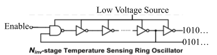

The output then goes to a split level converter[^2] (SLC). The sensing elements operates at a lower voltage relative to the rest of the components, so the oscillation is converted to a higher voltage before processing. SLC aux cell handle this low to high conversion while the leakage header using stacked native I/O devices serves as a voltage regulator to generate a lower voltage with high tolerance against supply variations.
[^2]: Y. Kim, Y. Lee, D. Sylvester and D. Blaauw, "SLC: Split-control Level Converter for dense and stable wide-range voltage conversion," 2012 Proceedings of the ESSCIRC (ESSCIRC), 2012, pp. 478-481, doi: 10.1109/ESSCIRC.2012.6341359.


To process the digital oscillation into a temperature reading, a comparison circuit is used consisting of two digital counters and logical components. These ripple counters compare the frequency difference between the sensor oscillator and a reference clock. Note that an invarient reference clock is required. This comparison circuit outputs a 24 bit number corresponding to the temperature. The figure below summarizes the function of the temperature sensor.

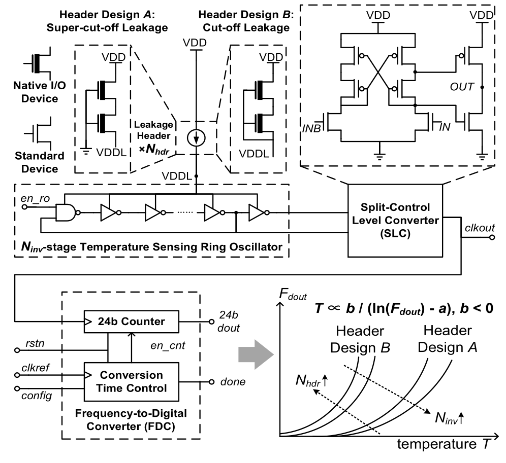

The temperature sensor will output a 24 bit code, which can be converted to the temperature value based on a known calibration function of the following form
$$T\propto\frac{b}{\ln{d_{out}}-a}$$ 
$$\text{where }d_{out}\text{ is the 24 bit output,}$$
$$\text{where }a\text{ and }b\text{ are calibration variables}$$

Note that a and b should be experimentally set for a produced chip.

## 8b. Generator Flow
The temperature sensor applies the below described process to translate a specification into a circuit GDS. 

Before beginning, we must set up our python environment with the necessary open-source tools. The generator uses a flexible set of tools and will support even more in the future. In the below flow walkthrough, we will use:
*   Yosys for logic synthesis
*   Openroad for placing and routing
*   Klayout to produce the final GDS file
*   Magic for DRC and LVS checks as well as PEX
*   Ngspice for simulation

There may be a restart runtime warning after this code block, but disregard.
```
# install all tools and dependencies
import os
import pathlib
import sys

!apt install -y time build-essential
!curl -Ls https://micro.mamba.pm/api/micromamba/linux-64/latest | tar -xvj bin/micromamba
conda_prefix_path = pathlib.Path('conda-env')
CONDA_PREFIX = str(conda_prefix_path.resolve())
%env CONDA_PREFIX={CONDA_PREFIX}
!echo 'python ==3.7*' >> {CONDA_PREFIX}/conda-meta/pinned
site_package_path = conda_prefix_path / 'lib/python3.7/site-packages'
sys.path.append(str(site_package_path.resolve()))
!bin/micromamba create --yes --prefix $CONDA_PREFIX
!bin/micromamba install --yes --prefix $CONDA_PREFIX \
                        --channel litex-hub \
                        --channel main \
                        open_pdks.sky130a \
                        magic \
                        netgen \
                        openroad \
                        yosys \
                        klayout 
!bin/micromamba install --yes --prefix $CONDA_PREFIX \
                        --channel conda-forge \
                        svgutils ngspice

!python -m pip install pyyaml click gdstk --no-binary gdstk
PATH = os.environ['PATH']
# clone OpenFASOC repo
!git clone https://github.com/idea-fasoc/OpenFASOC
# setup env
OPENFASOC_ROOT=str(pathlib.Path('OpenFASOC').resolve())
TEMP_SENSE_ROOT=OPENFASOC_ROOT+"/openfasoc/generators/temp-sense-gen/"
!cp OpenFASOC/openfasoc/generators/temp-sense-gen/blocks/sky130hd/gds/HEADER.gds OpenFASOC/docs/source/notebooks/aux_files
!cp OpenFASOC/openfasoc/generators/temp-sense-gen/blocks/sky130hd/gds/SLC.gds OpenFASOC/docs/source/notebooks/aux_files
!cp OpenFASOC/openfasoc/common/platforms/sky130hd/gds/sky130_fd_sc_hd.gds OpenFASOC/docs/source/notebooks/aux_files
!cp OpenFASOC/openfasoc/common/platforms/sky130hd/fill.json OpenFASOC/docs/source/notebooks/aux_files

%env PDK_ROOT={CONDA_PREFIX}/share/pdk
%env OPENFASOC_ROOT={OPENFASOC_ROOT}
PATH = os.environ['PATH']
%env PATH={PATH}:{CONDA_PREFIX}/bin:{OPENFASOC_ROOT}:{OPENFASOC_ROOT}/openfasoc/generators/temp-sense-gen/tools
LD_LIBRARY_PATH = os.environ.get('LD_LIBRARY_PATH', '')
%env LD_LIBRARY_PATH={LD_LIBRARY_PATH}:{CONDA_PREFIX}/lib/python3.7

```
## 8c. Understanding User Input
The generator must first parse the user’s requirements into a high-level circuit description or verilog. Note that verilog is a circuit description type that uses theoretical constructs (like mathematical operators, if-else blocks, always @ blocks,... etc) to concisely describe circuits. User input parsing is implemented by reading from a JSON spec file directly in the temp-sense-gen repository. The JSON allows for specifying power, area, maximum error (temperature result accuracy), an optimization option (to choose which option to prioritize), and an operating temperature range (minimum and maximum operating temperature values). The operating temperature range and optimization must be specified, but other items can be left blank. The example we are using here runs the sky130 node, and we already have a silicon model file for this node. The generator uses this model file to automatically determine the number of headers and inverters, among other necessary modifications that can be made to meet spec. The generator references the model file in an iterative process until either meeting spec or failing. A verilog description is then produced by substituting specifics into several template verilog files.

You can see this solve and verilog generation by running the code below and exploring the temp-sense-gen/src folder in your python virtual environment:

```
!cd OpenFASOC/openfasoc/generators/temp-sense-gen && make sky130hd_temp_verilog
```
## 8d. Logic Synthesis
At this phase, the implementation of fundamental components — such as transistors and resistors — is not considered. Logic synthesis takes the verilog description from the previous step and outputs a more detailed netlist by parsing theoretical verilog constructs like always, case, if-else, operator, etc… blocks. Note that a netlist is just a list of pins and component connections. Additionally the entire description is consolidated into one file (not considering the node specific library files we will need later) which means that the low and high voltage components are correctly connected. Specifics such as the shapes, placement, length, size of wires and components, along with power connections are still not considered. 

You can see the synthesis step by running the code below and viewing the temp-sense-gen/flow/results/sky130hd/tempsense/1_synth.v file in your python virtual environment:
```
!cd OpenFASOC/openfasoc/generators/temp-sense-gen/flow && make synth
```
## 8e. Automatic Place and Route
Now that we have a description of our circuit which includes specific connections and components to use, it is possible to consider drawing the wires, placing the components, and choosing materials. Below is a step-by-step visual breakdown of the openroad APR.
## 8f. Floorplan
First, an outline of the circuit is created encompassing the area that the circuit will occupy and including all the input and output pins for the top level circuit. Inside the temperature sensor, power rails, tap, and decap cells are placed. The tap and decap cells serve to address manufacturing and real-world circuit performance concerns. Within the box, a grid is formed with rows of fixed height.

Input header.gds and slc.gds files are provided before doing the floorplanning stage.
The header.gds is pre generated and is shown in the figure below.

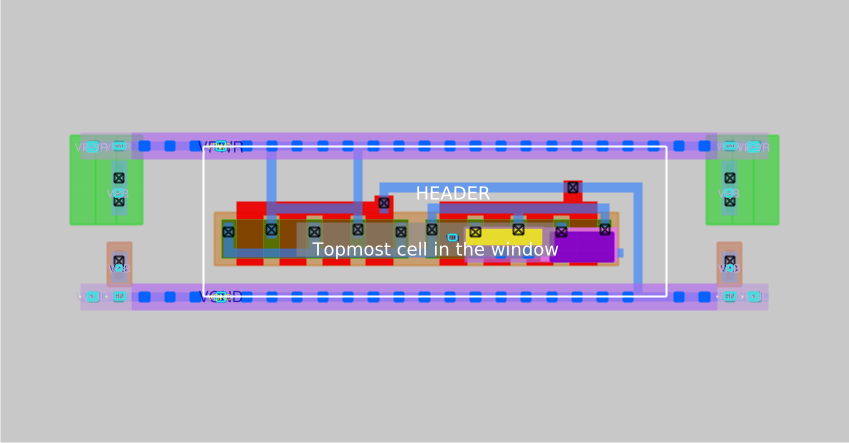

and the SLC.gds file 
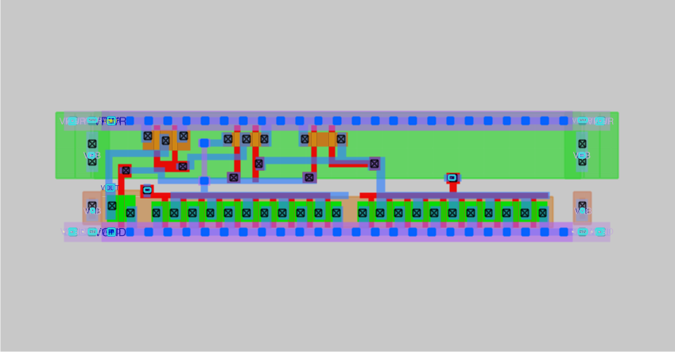

Run floorplan and render a polygon graphic for this stage by executing the code below:

```
!cd OpenFASOC/openfasoc/generators/temp-sense-gen/flow && make floorplan
```
```
import gdstk
import os
import IPython.display
import svgutils.transform as sg
# work dir setup
!cp OpenFASOC/openfasoc/generators/temp-sense-gen/flow/results/sky130hd/tempsense/2_floorplan.odb OpenFASOC/docs/source/notebooks/aux_files
os.environ['from_oprd_'] = '2_floorplan.odb'
os.environ['to_oprd_'] = 'out2.def'
# convert odb to def
!cd OpenFASOC/docs/source/notebooks/aux_files && openroad -no_init -exit dbtodef.tcl
# convert def to gds
!cd OpenFASOC/docs/source/notebooks/aux_files && klayout -zz -rd design_name=tempsenseInst_error \
	        -rd in_def="out2.def" \
	        -rd in_gds="HEADER.gds SLC.gds sky130_fd_sc_hd.gds" \
	        -rd config_file="fill.json" \
	        -rd out_gds="out2.gds" \
	        -rd tech_file="klayout.lyt" \
	        -rm def2gds.py
!cp OpenFASOC/docs/source/notebooks/aux_files/out2.gds /content
flrpln = gdstk.read_gds("out2.gds".format(TEMP_SENSE_ROOT))
flrpln_top_cell = flrpln.top_level()
flrpln_top_cell[0].write_svg('out2.svg')
fig = sg.fromfile('out2.svg')
fig.set_size(('700','700'))
fig.save('out2.svg')
IPython.display.SVG('out2.svg')
```
The floorplan log files shows
```
number instances in verilog is 163
[INFO IFP-0001] Added 42 rows of 258 sites.
[INFO RSZ-0026] Removed 13 buffers.
Default units for flow
 time 1ns
 capacitance 1pF
 resistance 1kohm
 voltage 1v
 current 1mA
 power 1nW
 distance 1um

==========================================================================
floorplan final report_tns
--------------------------------------------------------------------------
tns 0.00

==========================================================================
floorplan final report_wns
--------------------------------------------------------------------------
wns 0.00

==========================================================================
floorplan final report_worst_slack
--------------------------------------------------------------------------
worst slack INF

==========================================================================
floorplan final report_clock_skew
--------------------------------------------------------------------------

==========================================================================
floorplan final report_checks -path_delay min
--------------------------------------------------------------------------
No paths found.

==========================================================================
floorplan final report_checks -path_delay max
--------------------------------------------------------------------------
No paths found.

==========================================================================
floorplan final report_checks -unconstrained
--------------------------------------------------------------------------
Startpoint: _176_ (falling edge-triggered flip-flop)
Endpoint: DOUT[10] (output port)
Path Group: (none)
Path Type: max

Fanout     Cap    Slew   Delay    Time   Description
-----------------------------------------------------------------------------
                  0.05    0.00    0.00 v _176_/CLK_N (sky130_fd_sc_hd__dfrtn_1)
                  0.05    0.34    0.34 v _176_/Q (sky130_fd_sc_hd__dfrtn_1)
     3    0.01                           temp_analog_1.async_counter_0.div_r[10] (net)
                  0.05    0.00    0.34 v _092_/A1 (sky130_fd_sc_hd__mux4_1)
                  0.08    0.49    0.83 v _092_/X (sky130_fd_sc_hd__mux4_1)
     1    0.00                           _053_ (net)
                  0.08    0.00    0.83 v _093_/B (sky130_fd_sc_hd__nand2_1)
                  0.05    0.08    0.90 ^ _093_/Y (sky130_fd_sc_hd__nand2_1)
     1    0.00                           _054_ (net)
                  0.05    0.00    0.90 ^ _094_/B1 (sky130_fd_sc_hd__o311a_1)
                  0.75    0.66    1.56 ^ _094_/X (sky130_fd_sc_hd__o311a_1)
    27    0.08                           _055_ (net)
                  0.75    0.00    1.56 ^ _129_/B (sky130_fd_sc_hd__nor3_1)
                  0.10    0.07    1.63 v _129_/Y (sky130_fd_sc_hd__nor3_1)
     1    0.00                           DOUT[10] (net)
                  0.10    0.00    1.63 v DOUT[10] (out)
                                  1.63   data arrival time
-----------------------------------------------------------------------------
(Path is unconstrained)


==========================================================================
floorplan final report_power
--------------------------------------------------------------------------
Group                  Internal  Switching    Leakage      Total
                          Power      Power      Power      Power (Watts)
----------------------------------------------------------------
Sequential             1.68e-13   3.57e-14   5.48e-10   5.48e-10  58.0%
Combinational          9.63e-14   1.04e-13   3.96e-10   3.96e-10  42.0%
Macro                  0.00e+00   0.00e+00   0.00e+00   0.00e+00   0.0%
Pad                    0.00e+00   0.00e+00   0.00e+00   0.00e+00   0.0%
----------------------------------------------------------------
Total                  2.65e-13   1.39e-13   9.44e-10   9.44e-10 100.0%
                           0.0%       0.0%     100.0%

==========================================================================
floorplan final report_design_area
--------------------------------------------------------------------------
Design area 1854 u^2 14% utilization.

Elapsed time: 0:00.64[h:]min:sec. CPU time: user 0.57 sys 0.05 (97%). Peak memory: 96384KB.
```

## 8g. Place 
Within the rows (visualized in the run above) the standard cells are placed. Cells are building block circuits that, when combined, implement the bulk of temperature sensor functionality. These standard components include: inverters or other logic gates, headers (used to convert from high to low voltage), SLC (used to convert from low to high voltage), etc. 

Run place and render a polygon graphic for this stage by executing the code below:
```
!cd OpenFASOC/openfasoc/generators/temp-sense-gen/flow && make place
```
```
import gdstk
import IPython.display
import svgutils.transform as sg
# work dir setup
!cp OpenFASOC/openfasoc/generators/temp-sense-gen/flow/results/sky130hd/tempsense/3_place.odb OpenFASOC/docs/source/notebooks/aux_files
os.environ['from_oprd_'] = '3_place.odb'
os.environ['to_oprd_'] = 'out3.def'
# convert odb to def
!cd OpenFASOC/docs/source/notebooks/aux_files && openroad -no_init -exit dbtodef.tcl
# convert def to gds
!cd OpenFASOC/docs/source/notebooks/aux_files && klayout -zz -rd design_name=tempsenseInst_error \
	        -rd in_def="out3.def" \
	        -rd in_gds="HEADER.gds SLC.gds sky130_fd_sc_hd.gds" \
	        -rd config_file="fill.json" \
	        -rd out_gds="out3.gds" \
	        -rd tech_file="klayout.lyt" \
	        -rm def2gds.py
!cp OpenFASOC/docs/source/notebooks/aux_files/out3.gds /content
flrpln = gdstk.read_gds("out3.gds".format(TEMP_SENSE_ROOT))
flrpln_top_cell = flrpln.top_level()
flrpln_top_cell[0].write_svg('out3.svg')
fig = sg.fromfile('out3.svg')
fig.set_size(('700','700'))
fig.save('out3.svg')
IPython.display.SVG('out3.svg')
```
T
## 8h. CTS
CTS stands for clock tree synthesis (balancing a clock delay to all parts of a circuit); We do not require this in the temperature sensor, but we do require the filler cells which are placed by openroad during CTS. Filler cells are exactly what they sound like. There are many large gaps (see the above run graphic) within each row, between components. These gaps must be filled such that there are continous silicon p and n wells — among other manufacturing and performance reasons. Fillers are placed to fill the gaps.

Run CTS and render a polygon graphic for this stage by executing the code below:
```
!cd OpenFASOC/openfasoc/generators/temp-sense-gen/flow && make cts
```
```
import gdstk
import IPython.display
import svgutils.transform as sg
# work dir setup
!cp OpenFASOC/openfasoc/generators/temp-sense-gen/flow/results/sky130hd/tempsense/4_cts.odb OpenFASOC/docs/source/notebooks/aux_files
os.environ['from_oprd_'] = '4_cts.odb'
os.environ['to_oprd_'] = 'out4.def'
# convert odb to def
!cd OpenFASOC/docs/source/notebooks/aux_files && openroad -no_init -exit dbtodef.tcl
# convert def to gds
!cd OpenFASOC/docs/source/notebooks/aux_files && klayout -zz -rd design_name=tempsenseInst_error \
	        -rd in_def="out4.def" \
	        -rd in_gds="HEADER.gds SLC.gds sky130_fd_sc_hd.gds" \
	        -rd config_file="fill.json" \
	        -rd out_gds="out4.gds" \
	        -rd tech_file="klayout.lyt" \
	        -rm def2gds.py
!cp OpenFASOC/docs/source/notebooks/aux_files/out4.gds /content
flrpln = gdstk.read_gds("out4.gds".format(TEMP_SENSE_ROOT))
flrpln_top_cell = flrpln.top_level()
flrpln_top_cell[0].write_svg('out4.svg')
fig = sg.fromfile('out4.svg')
fig.set_size(('700','700'))
fig.save('out4.svg')
IPython.display.SVG('out4.svg')
```
## 8i. Routing
The last step is to connect the components. During routing, wire-like pathways known as traces are placed in the design.

Run route and finish then render a polygon graphic by executing the code below:
```
!cd OpenFASOC/openfasoc/generators/temp-sense-gen/flow && make finish
```
```
import gdstk
import IPython.display
import svgutils.transform as sg
!cp OpenFASOC/openfasoc/generators/temp-sense-gen/flow/results/sky130hd/tempsense/6_final.gds /content
flrpln = gdstk.read_gds("6_final.gds".format(TEMP_SENSE_ROOT))
flrpln_top_cell = flrpln.top_level()
flrpln_top_cell[0].write_svg('6_final.svg')
fig = sg.fromfile('6_final.svg')
fig.set_size(('700','700'))
fig.save('6_final.svg')
IPython.display.SVG('6_final.svg')
```
## 8j. DRC and LVS
Now that the generator has completed the flow, an automatic checking process is initiated. DRC or design rule checking ensures that the final circuit obeys manufacturing rules. Rules are set by the foundry for each of their nodes. LVS or layout vs schematic will compare the final output from APR to the netlist that we gave the APR tool (in this case openroad). This ensures that APR ran correctly and our final circuit matches our netlist description from logic synthesis. Both of these steps will use magic (LVS will also run on magic).

Run checks by executing the below code. Both checks will give command line output below with complete status:
```
!cd OpenFASOC/openfasoc/generators/temp-sense-gen/flow && make magic_drc
!cd OpenFASOC/openfasoc/generators/temp-sense-gen/flow && make netgen_lvs
```
The final gds file generated after LVS and DRC checks is final.gds file which is shown in below figure.


The resultant files generated after all the stages is shown below
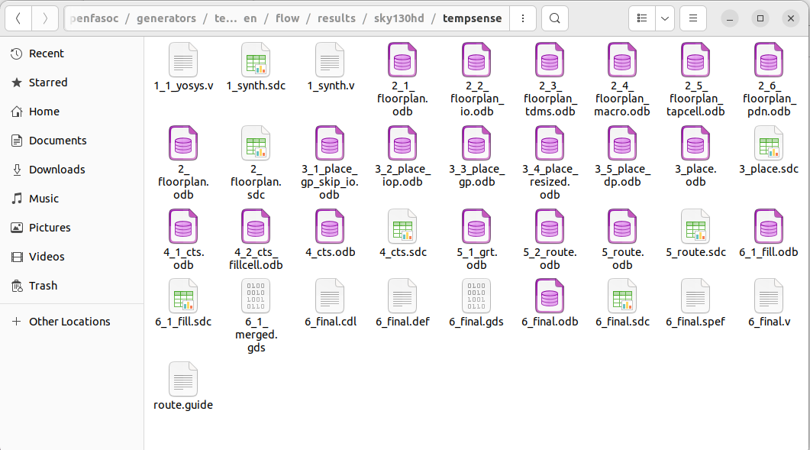
## 8k. Simulations
To see how the final design functions, run simulations across a temperature range by executing the code block below.

**_Note:_** This may take over 30 minutes.
```
%cd /content/OpenFASOC/openfasoc/generators/temp-sense-gen
!mkdir -p work
%cd tools
from simulation import generate_runs
import shutil
import json
import os
shutil.copyfile(
    "/content/OpenFASOC/openfasoc/generators/temp-sense-gen/flow/results/sky130hd/tempsense/6_final.gds",
    "/content/OpenFASOC/openfasoc/generators/temp-sense-gen/work/tempsenseInst_error.gds",
)
shutil.copyfile(
    "/content/OpenFASOC/openfasoc/generators/temp-sense-gen/flow/results/sky130hd/tempsense/6_final.def",
    "/content/OpenFASOC/openfasoc/generators/temp-sense-gen/work/tempsenseInst_error.def",
)
shutil.copyfile(
    "/content/OpenFASOC/openfasoc/generators/temp-sense-gen/flow/objects/sky130hd/tempsense/netgen_lvs/spice/tempsenseInst_error.spice",
    "/content/OpenFASOC/openfasoc/generators/temp-sense-gen/work/tempsenseInst_error.spice",
)
shutil.copyfile(
    "/content/OpenFASOC/openfasoc/generators/temp-sense-gen/flow/objects/sky130hd/tempsense/netgen_lvs/spice/tempsenseInst_error_pex.spice",
    "/content/OpenFASOC/openfasoc/generators/temp-sense-gen/work/tempsenseInst_error_pex.spice",
)
%cd ..
stage_var = [int(6) - 1]
header_var = [int(3)]
# make a temp list
temp_start = -20
temp_stop = 100
temp_step = 20
temp_points = int((temp_stop - temp_start) / temp_step)
temp_list = []
for i in range(0, temp_points + 1):
    temp_list.append(temp_start + i * temp_step)
with open("/content/OpenFASOC/openfasoc/common/platform_config.json") as file:
    jsonConfig = json.load(file)
pdkrt = os.environ.get('PDK_ROOT')
prepexDir = generate_runs(
    "/content/OpenFASOC/openfasoc/generators/temp-sense-gen/",
    "tempsenseInst_error",
    header_var,
    stage_var,
    temp_list,
    jsonConfig,
    "sky130hd",
    "sim",
    pdkrt+"/sky130A/",
    spiceDir="work",
    prePEX=True,
)
%cd /content
```
Run the below code block to view the sensor inaccuracy over the operating range -20 to 100C :
```
%cd /content/OpenFASOC/openfasoc/generators/temp-sense-gen
with open("tools/readparamgen.py","r") as pltr:
  pltr_str=pltr.read()
  pltr_str=pltr_str.replace("myplot.", "myplt.")
  pltr_str=pltr_str+"\nplot()\n"
with open("tools/readparamgen.py","w") as pltr:
  pltr.write(pltr_str)
!python3 tools/readparamgen.py --specfile test.json --outputDir ./work --platform sky130hd --mode macro
IPython.display.SVG('run_stats.svg')
```
To test the design we are using an input test.json file to see how much error we are getting after simulation.

```
{
    "module_name": "tempsenseInst_error",
    "generator": "temp-sense-gen",
    "specifications": {
    	"temperature": { "min": -20, "max": 100 },
    	"power": "",
    	"error": "",
    	"area": "",
    	"optimization":"error",
    	"model" :"modelfile.csv"
	}
}
```
Simulations takes some time about 15 minutes to run and we get this plot.
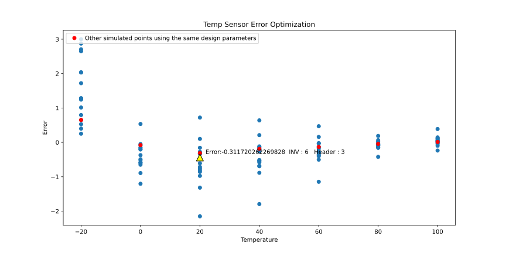


# WEEK 4
# 9. Generating and analysing an analog block(Ring Oscillator)
For generating the analog block for the ring oscillator we are using Xschem to generate the schematic and ALIGN tool and Magic to design the layout.
## 9a. Three stage ring oscillator schematic ( Xschem )
A self-toggling circuit known as a ring oscillator produces clock-like pulses without any external input other than the power it requires.
This is made by stacking odd-numbered inverters back to back (so that the next output is different than the previous).
The design of a 3-stage ring oscillator made in Xschem is depicted in the following figure. 
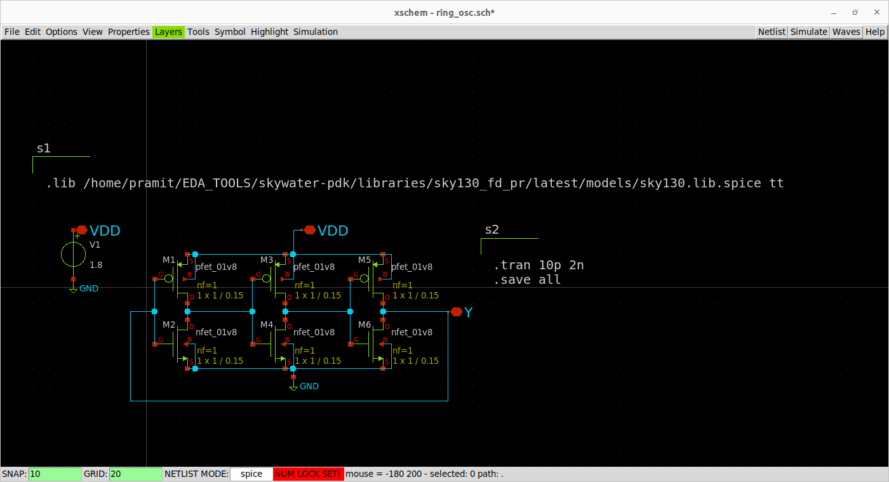

The extracted netlist from Xschem:
```
** sch_path: /home/pramit/EDA_TOOLS/work/week4/ring_osc.sch
**.subckt ring_osc VDD Y VDD
*.iopin VDD
*.iopin Y
*.iopin VDD
XM1 net1 Y VDD VDD sky130_fd_pr__pfet_01v8 L=0.15 W=1 nf=1 ad='int((nf+1)/2) * W/nf * 0.29' as='int((nf+2)/2) * W/nf * 0.29'
+ pd='2*int((nf+1)/2) * (W/nf + 0.29)' ps='2*int((nf+2)/2) * (W/nf + 0.29)' nrd='0.29 / W' nrs='0.29 / W'
+ sa=0 sb=0 sd=0 mult=1 m=1
XM2 net1 Y GND GND sky130_fd_pr__nfet_01v8 L=0.15 W=1 nf=1 ad='int((nf+1)/2) * W/nf * 0.29' as='int((nf+2)/2) * W/nf * 0.29'
+ pd='2*int((nf+1)/2) * (W/nf + 0.29)' ps='2*int((nf+2)/2) * (W/nf + 0.29)' nrd='0.29 / W' nrs='0.29 / W'
+ sa=0 sb=0 sd=0 mult=1 m=1
XM3 net2 net1 VDD VDD sky130_fd_pr__pfet_01v8 L=0.15 W=1 nf=1 ad='int((nf+1)/2) * W/nf * 0.29' as='int((nf+2)/2) * W/nf * 0.29'
+ pd='2*int((nf+1)/2) * (W/nf + 0.29)' ps='2*int((nf+2)/2) * (W/nf + 0.29)' nrd='0.29 / W' nrs='0.29 / W'
+ sa=0 sb=0 sd=0 mult=1 m=1
XM4 net2 net1 GND GND sky130_fd_pr__nfet_01v8 L=0.15 W=1 nf=1 ad='int((nf+1)/2) * W/nf * 0.29' as='int((nf+2)/2) * W/nf * 0.29'
+ pd='2*int((nf+1)/2) * (W/nf + 0.29)' ps='2*int((nf+2)/2) * (W/nf + 0.29)' nrd='0.29 / W' nrs='0.29 / W'
+ sa=0 sb=0 sd=0 mult=1 m=1
XM5 Y net2 VDD VDD sky130_fd_pr__pfet_01v8 L=0.15 W=1 nf=1 ad='int((nf+1)/2) * W/nf * 0.29' as='int((nf+2)/2) * W/nf * 0.29'
+ pd='2*int((nf+1)/2) * (W/nf + 0.29)' ps='2*int((nf+2)/2) * (W/nf + 0.29)' nrd='0.29 / W' nrs='0.29 / W'
+ sa=0 sb=0 sd=0 mult=1 m=1
XM6 Y net2 GND GND sky130_fd_pr__nfet_01v8 L=0.15 W=1 nf=1 ad='int((nf+1)/2) * W/nf * 0.29' as='int((nf+2)/2) * W/nf * 0.29'
+ pd='2*int((nf+1)/2) * (W/nf + 0.29)' ps='2*int((nf+2)/2) * (W/nf + 0.29)' nrd='0.29 / W' nrs='0.29 / W'
+ sa=0 sb=0 sd=0 mult=1 m=1
V1 VDD GND 1.8
.save i(v1)
**** begin user architecture code


.lib /home/pramit/EDA_TOOLS/skywater-pdk/libraries/sky130_fd_pr/latest/models/sky130.lib.spice tt


.tran 10p 2n
.save all


**** end user architecture code
**.ends
.GLOBAL GND
.end
```
To simulate this netlist we invoke ngspice using
```
ngspice ring_osc_xshcem.spice
```
The simulation is run for 2 nanosecond, which gives us an output as shown below.
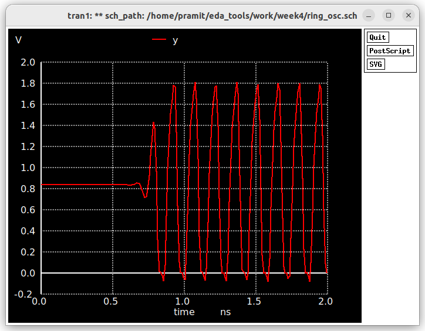

Without any parasitic capacitances the frequency of oscillation can be calculated as

``No of Oscillations/ Time interval= 4/0/5ns= 8 GHz``
## 9b. Automatic Layout generation using ALIGN Tool
The netlist generated by Xschem is modified to suit the input requirements for ALIGN.
The input netlist is given below
```
.subckt buffer_test_stage vin vout vdd vss
XM1 vout vin vss vss sky130_fd_pr__nfet_01v8 L=150n W=420n nf=10 m=1
XM2 vout vin vdd vdd sky130_fd_pr__pfet_01v8 L=150n W=840n nf=10 m=1
.ends

.subckt ring_osc vout vss vdd
xi1 vout net2 vdd vss buffer_test_stage
xi2 net2 net3 vdd vss buffer_test_stage
xi3 net3 vout vdd vss buffer_test_stage
.ends

```
Along with the .sp file we also need a .json file specifying the power VDD and GND ports.
The contents of which are given 
```
[
    {"constraint": "PowerPorts", "ports": ["vdd"]},
    {"constraint": "GroundPorts", "ports": ["vss"]}

]
```
Then, we can run the ALIGN layout generator using the following command.

[Note: My netlists are in the week4/ALIGN_LAYOUT_OSC/ring_osc/ directory and running ALIGN from ALIGN_Public/work/ directory and my sky130 pdk root is: ~/work/ALIGN_Public/pdks/ALIGN-pdk-sky130/SKY130_PDK]

```
schematic2layout.py ../ring_osc -p ../../pdks/ALIGN-pdk-sky130/SKY130_PDK 
```
The Layout generated(.gds) file generated

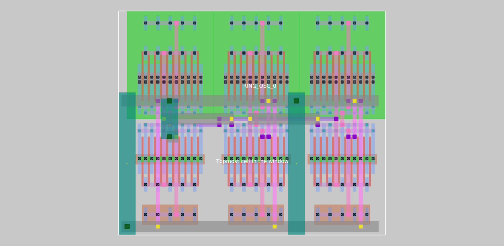

In order to extract the netlist from the Layout we open the gds file in magic and run
```
extract all
ext2spice scale off
ext2spice cthresh 0 rthresh 0
ext2spice hierarchy off
ext2spice
```
The netlist after adding the ngspice commands and the .lib files
```
* SPICE3 file created from RING_OSC_0.ext - technology: sky130A

.subckt RING_OSC_0 VOUT VSS VDD
X0 m1_2634_1400# VOUT VSS VSS sky130_fd_pr__nfet_01v8 ad=0.0588 pd=0.7 as=0.0588 ps=0.7 w=0.42 l=0.15
X1 m1_2634_1400# VOUT VSS VSS sky130_fd_pr__nfet_01v8 ad=0.0588 pd=0.7 as=0.0588 ps=0.7 w=0.42 l=0.15
X2 VSS VOUT m1_2634_1400# VSS sky130_fd_pr__nfet_01v8 ad=0.0588 pd=0.7 as=0.0588 ps=0.7 w=0.42 l=0.15
X3 VSS VOUT m1_2634_1400# VSS sky130_fd_pr__nfet_01v8 ad=0.0588 pd=0.7 as=0.0588 ps=0.7 w=0.42 l=0.15
X4 m1_2634_1400# VOUT VSS VSS sky130_fd_pr__nfet_01v8 ad=0.0588 pd=0.7 as=0.0588 ps=0.7 w=0.42 l=0.15
X5 m1_2634_1400# VOUT VSS VSS sky130_fd_pr__nfet_01v8 ad=0.0588 pd=0.7 as=0.0588 ps=0.7 w=0.42 l=0.15
X6 VSS VOUT m1_2634_1400# VSS sky130_fd_pr__nfet_01v8 ad=0.1113 pd=1.37 as=0.0588 ps=0.7 w=0.42 l=0.15
X7 m1_2634_1400# VOUT VSS VSS sky130_fd_pr__nfet_01v8 ad=0.0588 pd=0.7 as=0.1113 ps=1.37 w=0.42 l=0.15
X8 VSS VOUT m1_2634_1400# VSS sky130_fd_pr__nfet_01v8 ad=0.0588 pd=0.7 as=0.0588 ps=0.7 w=0.42 l=0.15
X9 VSS VOUT m1_2634_1400# VSS sky130_fd_pr__nfet_01v8 ad=0.0588 pd=0.7 as=0.0588 ps=0.7 w=0.42 l=0.15
X10 VDD VOUT m1_2634_1400# VDD sky130_fd_pr__pfet_01v8 ad=0.1176 pd=1.12 as=0.1176 ps=1.12 w=0.84 l=0.15
X11 m1_2634_1400# VOUT VDD VDD sky130_fd_pr__pfet_01v8 ad=0.1176 pd=1.12 as=0.1176 ps=1.12 w=0.84 l=0.15
X12 m1_2634_1400# VOUT VDD VDD sky130_fd_pr__pfet_01v8 ad=0.1176 pd=1.12 as=0.1176 ps=1.12 w=0.84 l=0.15
X13 VDD VOUT m1_2634_1400# VDD sky130_fd_pr__pfet_01v8 ad=0.2226 pd=2.21 as=0.1176 ps=1.12 w=0.84 l=0.15
X14 m1_2634_1400# VOUT VDD VDD sky130_fd_pr__pfet_01v8 ad=0.1176 pd=1.12 as=0.2226 ps=2.21 w=0.84 l=0.15
X15 VDD VOUT m1_2634_1400# VDD sky130_fd_pr__pfet_01v8 ad=0.1176 pd=1.12 as=0.1176 ps=1.12 w=0.84 l=0.15
X16 VDD VOUT m1_2634_1400# VDD sky130_fd_pr__pfet_01v8 ad=0.1176 pd=1.12 as=0.1176 ps=1.12 w=0.84 l=0.15
X17 m1_2634_1400# VOUT VDD VDD sky130_fd_pr__pfet_01v8 ad=0.1176 pd=1.12 as=0.1176 ps=1.12 w=0.84 l=0.15
X18 m1_2634_1400# VOUT VDD VDD sky130_fd_pr__pfet_01v8 ad=0.1176 pd=1.12 as=0.1176 ps=1.12 w=0.84 l=0.15
X19 VDD VOUT m1_2634_1400# VDD sky130_fd_pr__pfet_01v8 ad=0.1176 pd=1.12 as=0.1176 ps=1.12 w=0.84 l=0.15
X20 m1_1430_1400# m1_2634_1400# VSS VSS sky130_fd_pr__nfet_01v8 ad=0.0588 pd=0.7 as=0.0588 ps=0.7 w=0.42 l=0.15
X21 m1_1430_1400# m1_2634_1400# VSS VSS sky130_fd_pr__nfet_01v8 ad=0.0588 pd=0.7 as=0.0588 ps=0.7 w=0.42 l=0.15
X22 VSS m1_2634_1400# m1_1430_1400# VSS sky130_fd_pr__nfet_01v8 ad=0.0588 pd=0.7 as=0.0588 ps=0.7 w=0.42 l=0.15
X23 VSS m1_2634_1400# m1_1430_1400# VSS sky130_fd_pr__nfet_01v8 ad=0.0588 pd=0.7 as=0.0588 ps=0.7 w=0.42 l=0.15
X24 m1_1430_1400# m1_2634_1400# VSS VSS sky130_fd_pr__nfet_01v8 ad=0.0588 pd=0.7 as=0.0588 ps=0.7 w=0.42 l=0.15
X25 m1_1430_1400# m1_2634_1400# VSS VSS sky130_fd_pr__nfet_01v8 ad=0.0588 pd=0.7 as=0.0588 ps=0.7 w=0.42 l=0.15
X26 VSS m1_2634_1400# m1_1430_1400# VSS sky130_fd_pr__nfet_01v8 ad=0.1113 pd=1.37 as=0.0588 ps=0.7 w=0.42 l=0.15
X27 m1_1430_1400# m1_2634_1400# VSS VSS sky130_fd_pr__nfet_01v8 ad=0.0588 pd=0.7 as=0.1113 ps=1.37 w=0.42 l=0.15
X28 VSS m1_2634_1400# m1_1430_1400# VSS sky130_fd_pr__nfet_01v8 ad=0.0588 pd=0.7 as=0.0588 ps=0.7 w=0.42 l=0.15
X29 VSS m1_2634_1400# m1_1430_1400# VSS sky130_fd_pr__nfet_01v8 ad=0.0588 pd=0.7 as=0.0588 ps=0.7 w=0.42 l=0.15
X30 VDD m1_2634_1400# m1_1430_1400# VDD sky130_fd_pr__pfet_01v8 ad=0.1176 pd=1.12 as=0.1176 ps=1.12 w=0.84 l=0.15
X31 m1_1430_1400# m1_2634_1400# VDD VDD sky130_fd_pr__pfet_01v8 ad=0.1176 pd=1.12 as=0.1176 ps=1.12 w=0.84 l=0.15
X32 m1_1430_1400# m1_2634_1400# VDD VDD sky130_fd_pr__pfet_01v8 ad=0.1176 pd=1.12 as=0.1176 ps=1.12 w=0.84 l=0.15
X33 VDD m1_2634_1400# m1_1430_1400# VDD sky130_fd_pr__pfet_01v8 ad=0.2226 pd=2.21 as=0.1176 ps=1.12 w=0.84 l=0.15
X34 m1_1430_1400# m1_2634_1400# VDD VDD sky130_fd_pr__pfet_01v8 ad=0.1176 pd=1.12 as=0.2226 ps=2.21 w=0.84 l=0.15
X35 VDD m1_2634_1400# m1_1430_1400# VDD sky130_fd_pr__pfet_01v8 ad=0.1176 pd=1.12 as=0.1176 ps=1.12 w=0.84 l=0.15
X36 VDD m1_2634_1400# m1_1430_1400# VDD sky130_fd_pr__pfet_01v8 ad=0.1176 pd=1.12 as=0.1176 ps=1.12 w=0.84 l=0.15
X37 m1_1430_1400# m1_2634_1400# VDD VDD sky130_fd_pr__pfet_01v8 ad=0.1176 pd=1.12 as=0.1176 ps=1.12 w=0.84 l=0.15
X38 m1_1430_1400# m1_2634_1400# VDD VDD sky130_fd_pr__pfet_01v8 ad=0.1176 pd=1.12 as=0.1176 ps=1.12 w=0.84 l=0.15
X39 VDD m1_2634_1400# m1_1430_1400# VDD sky130_fd_pr__pfet_01v8 ad=0.1176 pd=1.12 as=0.1176 ps=1.12 w=0.84 l=0.15
X40 VOUT m1_1430_1400# VSS VSS sky130_fd_pr__nfet_01v8 ad=0.0588 pd=0.7 as=0.0588 ps=0.7 w=0.42 l=0.15
X41 VOUT m1_1430_1400# VSS VSS sky130_fd_pr__nfet_01v8 ad=0.0588 pd=0.7 as=0.0588 ps=0.7 w=0.42 l=0.15
X42 VSS m1_1430_1400# VOUT VSS sky130_fd_pr__nfet_01v8 ad=0.0588 pd=0.7 as=0.0588 ps=0.7 w=0.42 l=0.15
X43 VSS m1_1430_1400# VOUT VSS sky130_fd_pr__nfet_01v8 ad=0.0588 pd=0.7 as=0.0588 ps=0.7 w=0.42 l=0.15
X44 VOUT m1_1430_1400# VSS VSS sky130_fd_pr__nfet_01v8 ad=0.0588 pd=0.7 as=0.0588 ps=0.7 w=0.42 l=0.15
X45 VOUT m1_1430_1400# VSS VSS sky130_fd_pr__nfet_01v8 ad=0.0588 pd=0.7 as=0.0588 ps=0.7 w=0.42 l=0.15
X46 VSS m1_1430_1400# VOUT VSS sky130_fd_pr__nfet_01v8 ad=0.1113 pd=1.37 as=0.0588 ps=0.7 w=0.42 l=0.15
X47 VOUT m1_1430_1400# VSS VSS sky130_fd_pr__nfet_01v8 ad=0.0588 pd=0.7 as=0.1113 ps=1.37 w=0.42 l=0.15
X48 VSS m1_1430_1400# VOUT VSS sky130_fd_pr__nfet_01v8 ad=0.0588 pd=0.7 as=0.0588 ps=0.7 w=0.42 l=0.15
X49 VSS m1_1430_1400# VOUT VSS sky130_fd_pr__nfet_01v8 ad=0.0588 pd=0.7 as=0.0588 ps=0.7 w=0.42 l=0.15
X50 VDD m1_1430_1400# VOUT VDD sky130_fd_pr__pfet_01v8 ad=0.1176 pd=1.12 as=0.1176 ps=1.12 w=0.84 l=0.15
X51 VOUT m1_1430_1400# VDD VDD sky130_fd_pr__pfet_01v8 ad=0.1176 pd=1.12 as=0.1176 ps=1.12 w=0.84 l=0.15
X52 VOUT m1_1430_1400# VDD VDD sky130_fd_pr__pfet_01v8 ad=0.1176 pd=1.12 as=0.1176 ps=1.12 w=0.84 l=0.15
X53 VDD m1_1430_1400# VOUT VDD sky130_fd_pr__pfet_01v8 ad=0.2226 pd=2.21 as=0.1176 ps=1.12 w=0.84 l=0.15
X54 VOUT m1_1430_1400# VDD VDD sky130_fd_pr__pfet_01v8 ad=0.1176 pd=1.12 as=0.2226 ps=2.21 w=0.84 l=0.15
X55 VDD m1_1430_1400# VOUT VDD sky130_fd_pr__pfet_01v8 ad=0.1176 pd=1.12 as=0.1176 ps=1.12 w=0.84 l=0.15
X56 VDD m1_1430_1400# VOUT VDD sky130_fd_pr__pfet_01v8 ad=0.1176 pd=1.12 as=0.1176 ps=1.12 w=0.84 l=0.15
X57 VOUT m1_1430_1400# VDD VDD sky130_fd_pr__pfet_01v8 ad=0.1176 pd=1.12 as=0.1176 ps=1.12 w=0.84 l=0.15
X58 VOUT m1_1430_1400# VDD VDD sky130_fd_pr__pfet_01v8 ad=0.1176 pd=1.12 as=0.1176 ps=1.12 w=0.84 l=0.15
X59 VDD m1_1430_1400# VOUT VDD sky130_fd_pr__pfet_01v8 ad=0.1176 pd=1.12 as=0.1176 ps=1.12 w=0.84 l=0.15
C0 m1_1430_1400# VDD 9.00fF
C1 m1_2634_1400# VDD 8.67fF
C2 VOUT m1_1430_1400# 3.39fF
C3 VOUT VDD 9.42fF
C4 VOUT m1_2634_1400# 2.43fF
C5 VOUT VSS 4.17fF
C6 m1_1430_1400# VSS 7.58fF 
C7 VDD VSS 20.93fF
C8 m1_2634_1400# VSS 7.52fF 
.ends

*=======Added manually========
X1 out GND VDD RING_OSC_0
V1 VDD GND 1.8
**** begin user architecture code

.lib /home/pramit/EDA_TOOLS/skywater-pdk/libraries/sky130_fd_pr/latest/models/sky130.lib.spice tt

.control
save all
tran 10p 4n
plot out
.endc

```
Invoking ngspice with
```
ngspice RING_OSC_0.spice
```
The postlayout simulation waveform can be seen from the following figure.
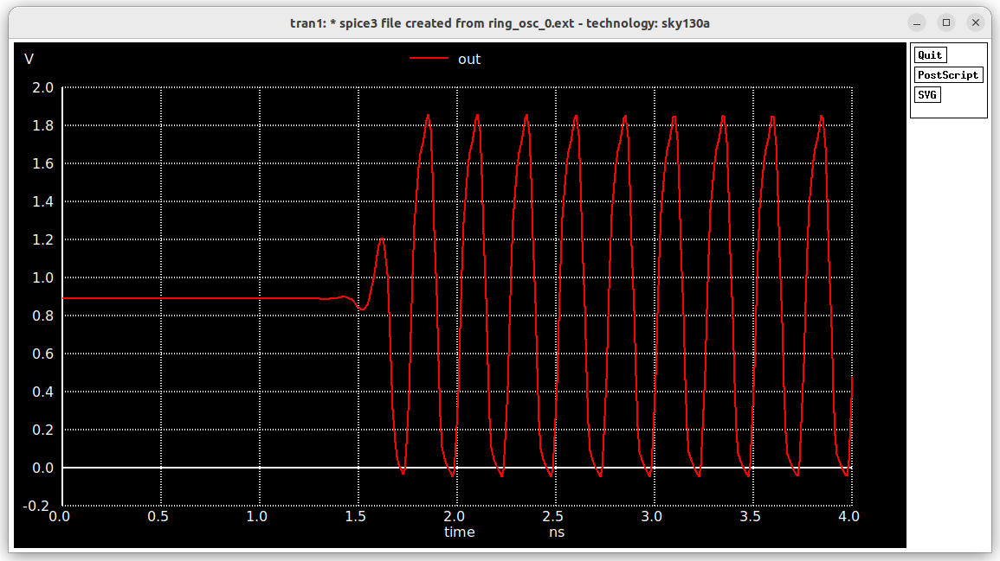

## 9c. Manual layout using Magic
As we are not getting the correct results from ALIGN, it is better to do a manual layout using Magic to proceed further to later stages.
 
( Note: In order to easily create and customize nmos and pmos by the help of inbuilt console in magic run it using an .magicrc file found in the sky130A libs.tech folder
`` magic -rcfile sky130A.magicrc`` )

The figure below shows the manual layout done with all the added labels and ports.
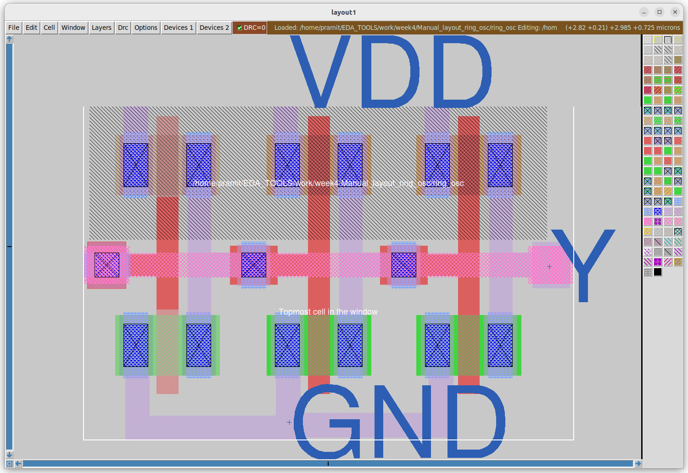

To extract the netlist use
```
extract all
ext2spice scale off
ext2spice cthresh 0 rthresh 0
ext2spice hierarchy off
ext2spice
```
The extracted netlist after adding the ngspice control commands and .lib files
```
* SPICE3 file created from /home/pramit/EDA_TOOLS/work/week4/Manual_layout_ring_osc/ring_osc.ext - technology: sky130A

.subckt ring_osc VDD Y GND
X0 a_173_115# Y GND VSUBS sky130_fd_pr__nfet_01v8 ad=0.1218 pd=1.42 as=0.1218 ps=1.42 w=0.42 l=0.15
X1 a_173_115# Y VDD w_188_178# sky130_fd_pr__pfet_01v8 ad=0.1218 pd=1.42 as=0.1218 ps=1.42 w=0.42 l=0.15
X2 a_312_n12# a_173_115# VDD w_188_178# sky130_fd_pr__pfet_01v8 ad=0.1218 pd=1.42 as=0.1218 ps=1.42 w=0.42 l=0.15
X3 a_312_n12# a_173_115# GND VSUBS sky130_fd_pr__nfet_01v8 ad=0.1218 pd=1.42 as=0.1218 ps=1.42 w=0.42 l=0.15
X4 Y a_312_n12# VDD w_188_178# sky130_fd_pr__pfet_01v8 ad=0.1218 pd=1.42 as=0.1218 ps=1.42 w=0.42 l=0.15
X5 Y a_312_n12# GND VSUBS sky130_fd_pr__nfet_01v8 ad=0.1218 pd=1.42 as=0.1218 ps=1.42 w=0.42 l=0.15
C0 a_312_n12# w_188_178# 0.09fF
C1 GND a_173_115# 0.19fF
C2 VDD w_188_178# 0.15fF
C3 GND Y 0.13fF
C4 GND a_312_n12# 0.18fF
C5 a_173_115# Y 0.12fF
C6 a_312_n12# a_173_115# 0.08fF
C7 GND VDD 0.05fF
C8 GND w_188_178# 0.02fF
C9 a_312_n12# Y 0.10fF
C10 VDD a_173_115# 0.18fF
C11 a_173_115# w_188_178# 0.10fF
C12 VDD Y 0.12fF
C13 a_312_n12# VDD 0.17fF
C14 Y w_188_178# 0.10fF
C15 a_312_n12# VSUBS 0.23fF
C16 w_188_178# VSUBS 0.40fF 
C17 a_173_115# VSUBS 0.21fF 
C18 GND VSUBS 0.01fF
C19 Y VSUBS 0.60fF
.ends

.lib /home/pramit/EDA_TOOLS/skywater-pdk/libraries/sky130_fd_pr/latest/models/sky130.lib.spice tt
X1 VDD Y GND ring_osc
V1 VDD GND 1.8

.tran 10p 2n
.save all

.control
  run
  plot y
.endc
```
The output waveform for the netlist with extracted parasitics is shown below.
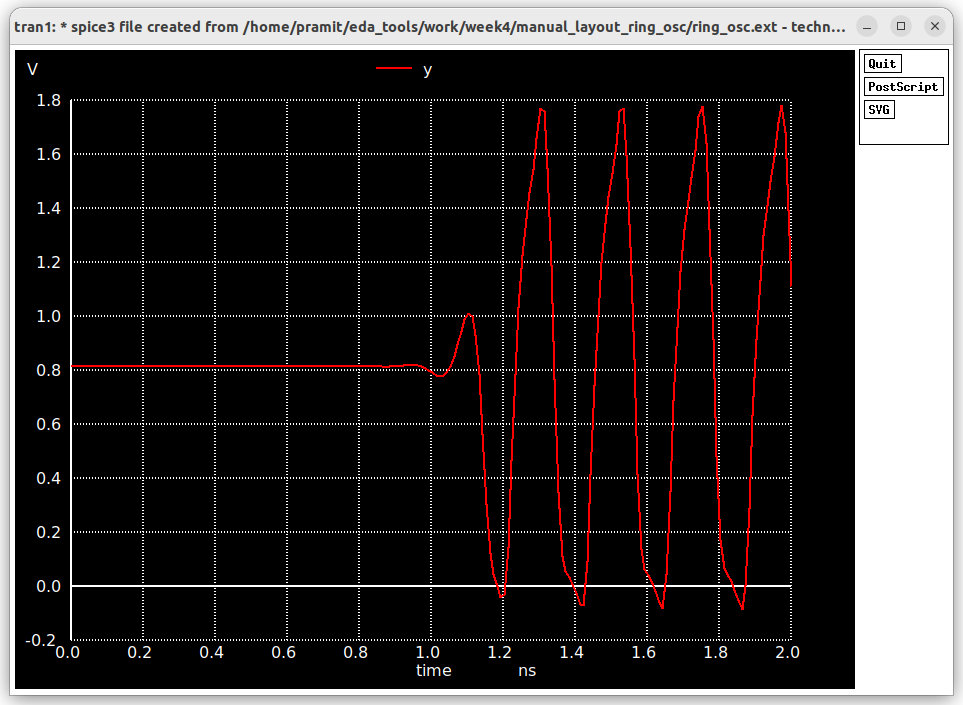

The oscillation frequency is ``4/0.8ns=5Ghz``
However, if we extract the netlist without parasitics by running
```
extract all
ext2spice scale off
ext2spice cthresh infinite rthresh infinite
ext2spice hierarchy off
ext2spice
```
We get this waveform after simulation.

The oscillation frequency is ``4/0.5ns=8Ghz``

## 9d. Comparison between Pre-layout and Post-Layout Simulation
Pre-Layout|Post Layout with Magic(Manual Layout) | Post-Layout with ALIGN(Automatic) | 
|--------------------------|-------------------------|-------------------------|

 
# WEEK 5
## 10. Generating and analysing a 1-bit ADC
For generating the analog block for the 1 bit adc we are using Xschem to generate the schematic and ALIGN tool and Magic to design the layout.

## 10a. Comparator design 
For the comparator used in the adc the schematic is drawn according to the following schematic

The schematic of which is shown below.
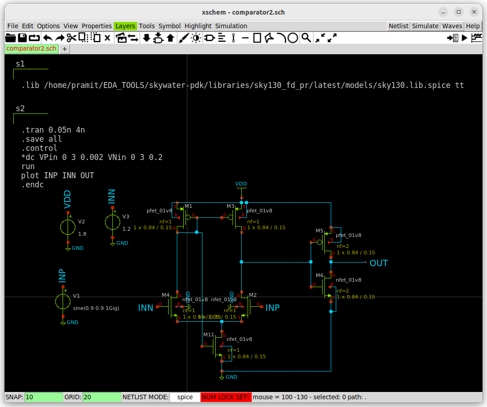 

The prelayout simulation is done using the netlist generated by xschem.
```
** sch_path: /home/pramit/EDA_TOOLS/work/week5/comparator_hs/comparator2.sch
**.subckt comparator2
XM1 net1 net1 VDD VDD sky130_fd_pr__pfet_01v8 L=0.15 W=0.84 nf=1 ad='int((nf+1)/2) * W/nf * 0.29' as='int((nf+2)/2) * W/nf * 0.29'
+ pd='2*int((nf+1)/2) * (W/nf + 0.29)' ps='2*int((nf+2)/2) * (W/nf + 0.29)' nrd='0.29 / W' nrs='0.29 / W'
+ sa=0 sb=0 sd=0 mult=1 m=1
XM2 net3 INP net2 GND sky130_fd_pr__nfet_01v8 L=0.15 W=1.05 nf=1 ad='int((nf+1)/2) * W/nf * 0.29' as='int((nf+2)/2) * W/nf * 0.29'
+ pd='2*int((nf+1)/2) * (W/nf + 0.29)' ps='2*int((nf+2)/2) * (W/nf + 0.29)' nrd='0.29 / W' nrs='0.29 / W'
+ sa=0 sb=0 sd=0 mult=1 m=1
XM3 net3 net1 VDD VDD sky130_fd_pr__pfet_01v8 L=0.15 W=0.84 nf=1 ad='int((nf+1)/2) * W/nf * 0.29' as='int((nf+2)/2) * W/nf * 0.29'
+ pd='2*int((nf+1)/2) * (W/nf + 0.29)' ps='2*int((nf+2)/2) * (W/nf + 0.29)' nrd='0.29 / W' nrs='0.29 / W'
+ sa=0 sb=0 sd=0 mult=1 m=1
XM4 net1 INN net2 GND sky130_fd_pr__nfet_01v8 L=0.15 W=0.84 nf=1 ad='int((nf+1)/2) * W/nf * 0.29' as='int((nf+2)/2) * W/nf * 0.29'
+ pd='2*int((nf+1)/2) * (W/nf + 0.29)' ps='2*int((nf+2)/2) * (W/nf + 0.29)' nrd='0.29 / W' nrs='0.29 / W'
+ sa=0 sb=0 sd=0 mult=1 m=1
XM11 net2 net1 GND GND sky130_fd_pr__nfet_01v8 L=0.15 W=0.84 nf=1 ad='int((nf+1)/2) * W/nf * 0.29' as='int((nf+2)/2) * W/nf * 0.29'
+ pd='2*int((nf+1)/2) * (W/nf + 0.29)' ps='2*int((nf+2)/2) * (W/nf + 0.29)' nrd='0.29 / W' nrs='0.29 / W'
+ sa=0 sb=0 sd=0 mult=1 m=1
V1 INP GND sine(0.9 0.9 0.5Gig)
.save i(v1)
V2 VDD GND 1.8
.save i(v2)
V3 INN GND 1.2
.save i(v3)
XM5 OUT net3 VDD VDD sky130_fd_pr__pfet_01v8 L=0.15 W=0.84 nf=2 ad='int((nf+1)/2) * W/nf * 0.29' as='int((nf+2)/2) * W/nf * 0.29'
+ pd='2*int((nf+1)/2) * (W/nf + 0.29)' ps='2*int((nf+2)/2) * (W/nf + 0.29)' nrd='0.29 / W' nrs='0.29 / W'
+ sa=0 sb=0 sd=0 mult=1 m=1
XM6 OUT net3 GND GND sky130_fd_pr__nfet_01v8 L=0.15 W=0.84 nf=2 ad='int((nf+1)/2) * W/nf * 0.29' as='int((nf+2)/2) * W/nf * 0.29'
+ pd='2*int((nf+1)/2) * (W/nf + 0.29)' ps='2*int((nf+2)/2) * (W/nf + 0.29)' nrd='0.29 / W' nrs='0.29 / W'
+ sa=0 sb=0 sd=0 mult=1 m=1
**** begin user architecture code


.lib /home/pramit/EDA_TOOLS/skywater-pdk/libraries/sky130_fd_pr/latest/models/sky130.lib.spice tt


.tran 0.05n 4n
.save all
.control
*dc VPin 0 3 0.002 VNin 0 3 0.2
run
plot INP INN OUT
.endc

**** end user architecture code
**.ends
.GLOBAL VDD
.GLOBAL GND
.end
```
Prelayout simulation


The layout is generated using ALIGN by this follwing .sp file
```
.subckt comparator VDD GND INP INN OUT
XM1 net1 net1 VDD VDD sky130_fd_pr__pfet_01v8 L=150n W=840n nf=2 m=1
XM2 net3 INP net2 GND sky130_fd_pr__nfet_01v8 L=150n W=840n nf=2 m=1
XM3 net3 net1 VDD VDD sky130_fd_pr__pfet_01v8 L=150n W=840n nf=2 m=1
XM4 net1 INN net2 GND sky130_fd_pr__nfet_01v8 L=150n W=840n nf=2 m=1
XM5 net2 net1 GND GND sky130_fd_pr__nfet_01v8 L=150n W=840n nf=2 m=1
XM6 OUT net3 VDD VDD sky130_fd_pr__pfet_01v8 L=150n W=840n nf=2 m=1
XM7 OUT net3 GND GND sky130_fd_pr__nfet_01v8 L=150n W=840n nf=2 m=1
.ends

```
Generated layout 
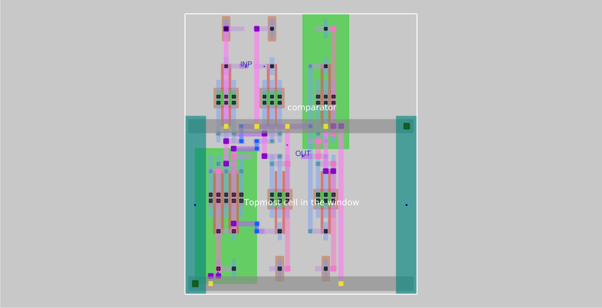

After carefully modifying the labels and converting to ports the following Postlayout simulation is obtained.
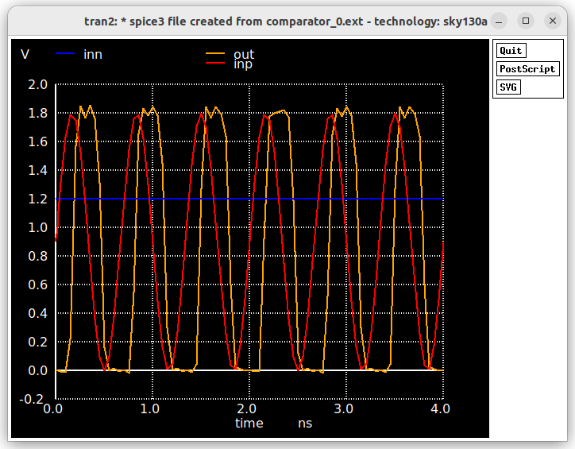

Now it is time to incorporate both the ring oscillator as well as the comparator to make the 1 bit adc.
## 10a. 1-bit adc schematic ( Xschem )
The adc incorporates a ring oscillator designed in previous stages along with a fast comparator circuit. 
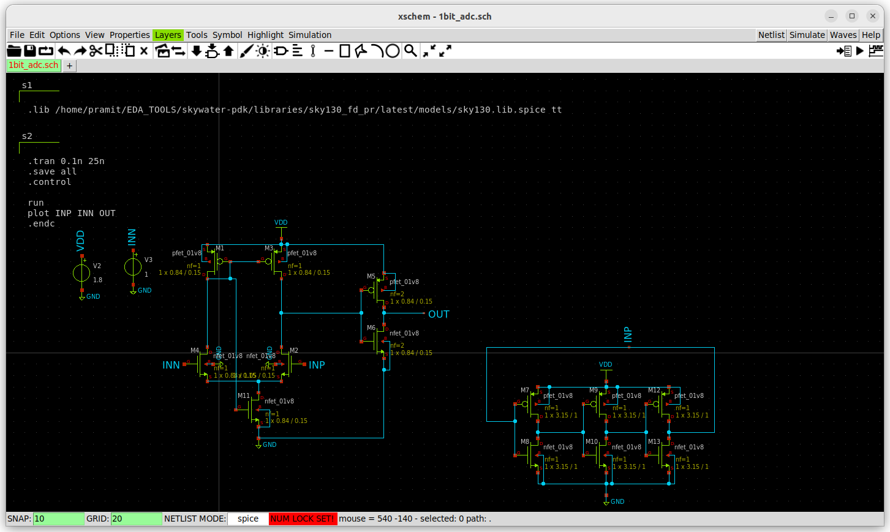
For Prelayout simulation spice netlist is extracted using Xschem itself along with all spice commands.
The extracted netlist
```
** sch_path: /home/pramit/EDA_TOOLS/work/week5/comparator_hs/1bit_adc.sch
**.subckt 1bit_adc
XM1 net1 net1 VDD VDD sky130_fd_pr__pfet_01v8 L=0.15 W=0.84 nf=1 ad='int((nf+1)/2) * W/nf * 0.29' as='int((nf+2)/2) * W/nf * 0.29'
+ pd='2*int((nf+1)/2) * (W/nf + 0.29)' ps='2*int((nf+2)/2) * (W/nf + 0.29)' nrd='0.29 / W' nrs='0.29 / W'
+ sa=0 sb=0 sd=0 mult=1 m=1
XM2 net3 INP net2 GND sky130_fd_pr__nfet_01v8 L=0.15 W=1.05 nf=1 ad='int((nf+1)/2) * W/nf * 0.29' as='int((nf+2)/2) * W/nf * 0.29'
+ pd='2*int((nf+1)/2) * (W/nf + 0.29)' ps='2*int((nf+2)/2) * (W/nf + 0.29)' nrd='0.29 / W' nrs='0.29 / W'
+ sa=0 sb=0 sd=0 mult=1 m=1
XM3 net3 net1 VDD VDD sky130_fd_pr__pfet_01v8 L=0.15 W=0.84 nf=1 ad='int((nf+1)/2) * W/nf * 0.29' as='int((nf+2)/2) * W/nf * 0.29'
+ pd='2*int((nf+1)/2) * (W/nf + 0.29)' ps='2*int((nf+2)/2) * (W/nf + 0.29)' nrd='0.29 / W' nrs='0.29 / W'
+ sa=0 sb=0 sd=0 mult=1 m=1
XM4 net1 INN net2 GND sky130_fd_pr__nfet_01v8 L=0.15 W=0.84 nf=1 ad='int((nf+1)/2) * W/nf * 0.29' as='int((nf+2)/2) * W/nf * 0.29'
+ pd='2*int((nf+1)/2) * (W/nf + 0.29)' ps='2*int((nf+2)/2) * (W/nf + 0.29)' nrd='0.29 / W' nrs='0.29 / W'
+ sa=0 sb=0 sd=0 mult=1 m=1
XM11 net2 net1 GND GND sky130_fd_pr__nfet_01v8 L=0.15 W=0.84 nf=1 ad='int((nf+1)/2) * W/nf * 0.29' as='int((nf+2)/2) * W/nf * 0.29'
+ pd='2*int((nf+1)/2) * (W/nf + 0.29)' ps='2*int((nf+2)/2) * (W/nf + 0.29)' nrd='0.29 / W' nrs='0.29 / W'
+ sa=0 sb=0 sd=0 mult=1 m=1
V1 net6 GND sine(0.9 0.9 1Gig)
.save i(v1)
V2 VDD GND 1.8
.save i(v2)
V3 INN GND 1
.save i(v3)
XM5 OUT net3 VDD VDD sky130_fd_pr__pfet_01v8 L=0.15 W=0.84 nf=2 ad='int((nf+1)/2) * W/nf * 0.29' as='int((nf+2)/2) * W/nf * 0.29'
+ pd='2*int((nf+1)/2) * (W/nf + 0.29)' ps='2*int((nf+2)/2) * (W/nf + 0.29)' nrd='0.29 / W' nrs='0.29 / W'
+ sa=0 sb=0 sd=0 mult=1 m=1
XM6 OUT net3 GND GND sky130_fd_pr__nfet_01v8 L=0.15 W=0.84 nf=2 ad='int((nf+1)/2) * W/nf * 0.29' as='int((nf+2)/2) * W/nf * 0.29'
+ pd='2*int((nf+1)/2) * (W/nf + 0.29)' ps='2*int((nf+2)/2) * (W/nf + 0.29)' nrd='0.29 / W' nrs='0.29 / W'
+ sa=0 sb=0 sd=0 mult=1 m=1
XM7 net4 INP VDD VDD sky130_fd_pr__pfet_01v8 L=1 W=3.15 nf=1 ad='int((nf+1)/2) * W/nf * 0.29' as='int((nf+2)/2) * W/nf * 0.29'
+ pd='2*int((nf+1)/2) * (W/nf + 0.29)' ps='2*int((nf+2)/2) * (W/nf + 0.29)' nrd='0.29 / W' nrs='0.29 / W'
+ sa=0 sb=0 sd=0 mult=1 m=1
XM8 net4 INP GND GND sky130_fd_pr__nfet_01v8 L=1 W=3.15 nf=1 ad='int((nf+1)/2) * W/nf * 0.29' as='int((nf+2)/2) * W/nf * 0.29'
+ pd='2*int((nf+1)/2) * (W/nf + 0.29)' ps='2*int((nf+2)/2) * (W/nf + 0.29)' nrd='0.29 / W' nrs='0.29 / W'
+ sa=0 sb=0 sd=0 mult=1 m=1
XM9 net5 net4 VDD VDD sky130_fd_pr__pfet_01v8 L=1 W=3.15 nf=1 ad='int((nf+1)/2) * W/nf * 0.29' as='int((nf+2)/2) * W/nf * 0.29'
+ pd='2*int((nf+1)/2) * (W/nf + 0.29)' ps='2*int((nf+2)/2) * (W/nf + 0.29)' nrd='0.29 / W' nrs='0.29 / W'
+ sa=0 sb=0 sd=0 mult=1 m=1
XM10 net5 net4 GND GND sky130_fd_pr__nfet_01v8 L=1 W=3.15 nf=1 ad='int((nf+1)/2) * W/nf * 0.29' as='int((nf+2)/2) * W/nf * 0.29'
+ pd='2*int((nf+1)/2) * (W/nf + 0.29)' ps='2*int((nf+2)/2) * (W/nf + 0.29)' nrd='0.29 / W' nrs='0.29 / W'
+ sa=0 sb=0 sd=0 mult=1 m=1
XM12 INP net5 VDD VDD sky130_fd_pr__pfet_01v8 L=1 W=3.15 nf=1 ad='int((nf+1)/2) * W/nf * 0.29' as='int((nf+2)/2) * W/nf * 0.29'
+ pd='2*int((nf+1)/2) * (W/nf + 0.29)' ps='2*int((nf+2)/2) * (W/nf + 0.29)' nrd='0.29 / W' nrs='0.29 / W'
+ sa=0 sb=0 sd=0 mult=1 m=1
XM13 INP net5 GND GND sky130_fd_pr__nfet_01v8 L=1 W=3.15 nf=1 ad='int((nf+1)/2) * W/nf * 0.29' as='int((nf+2)/2) * W/nf * 0.29'
+ pd='2*int((nf+1)/2) * (W/nf + 0.29)' ps='2*int((nf+2)/2) * (W/nf + 0.29)' nrd='0.29 / W' nrs='0.29 / W'
+ sa=0 sb=0 sd=0 mult=1 m=1
**** begin user architecture code


.lib /home/pramit/EDA_TOOLS/skywater-pdk/libraries/sky130_fd_pr/latest/models/sky130.lib.spice tt


.tran 0.1n 25n
.save all
.control

run
plot INP INN OUT
.endc

**** end user architecture code
**.ends
.GLOBAL VDD
.GLOBAL GND
.end
```
Simulating using Ngspice
``` ngspice adc.spice```
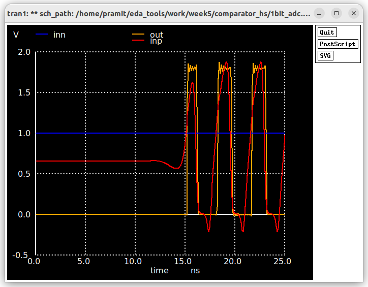

## 10b. Generating Layout using ALIGN
To generate the layout of the adc, the netlist extracted above from is simplified as follows.
```
.subckt adc VDD GND INP INN OUT
XM1 net1 net1 VDD VDD sky130_fd_pr__pfet_01v8 L=150n W=840n nf=4 m=1
XM2 net3 INP net2 GND sky130_fd_pr__nfet_01v8 L=150n W=840n nf=4 m=1
XM3 net3 net1 VDD VDD sky130_fd_pr__pfet_01v8 L=150n W=840n nf=4 m=1
XM4 net1 INN net2 GND sky130_fd_pr__nfet_01v8 L=150n W=840n nf=4 m=1
XM5 net2 net1 GND GND sky130_fd_pr__nfet_01v8 L=150n W=840n nf=4 m=1
XM6 OUT net3 VDD VDD sky130_fd_pr__pfet_01v8 L=150n W=840n nf=4 m=1
XM7 OUT net3 GND GND sky130_fd_pr__nfet_01v8 L=150n W=840n nf=4 m=1
XM8 net4 INP VDD VDD sky130_fd_pr__pfet_01v8 L=150n W=840n nf=4 m=1
XM9 net4 INP GND GND sky130_fd_pr__nfet_01v8 L=150n W=840n nf=4 m=1
XM10 net5 net4 VDD VDD sky130_fd_pr__pfet_01v8 L=150n W=840n nf=4 m=1
XM11 net5 net4 GND GND sky130_fd_pr__nfet_01v8 L=150n W=840n nf=4 m=1
XM12 INP net5 VDD VDD sky130_fd_pr__pfet_01v8 L=150n W=840n nf=4 m=1
XM13 INP net5 GND GND sky130_fd_pr__nfet_01v8 L=150n W=840n nf=4 m=1
C1 net4 GND sky130_fd_pr__cap_mim_m3_1 W=10000e-9 L=10000e-9 m=1
C2 net5 GND sky130_fd_pr__cap_mim_m3_1 W=10000e-9 L=10000e-9 m=1
C3 INP GND sky130_fd_pr__cap_mim_m3_1 W=10000e-9 L=10000e-9 m=1
.ends

```
and to add Power and ground ports to the layout adding a ``adc.const.json`` file with
```
[
    {"constraint": "PowerPorts", "ports": ["VDD"]},
    {"constraint": "GroundPorts", "ports": ["GND"]}
]

```
The Align flow generates the layout which may contain DRC errors and after carefully fixing these errors and manually placing labels(sometimes magic doesnt extract the labels in the netlist).
Then to extract the netlist we select the whole layout by pressing ``i`` and then using these commands.
```
port makeall
extract all
ext2spice scale off
ext2spice cthresh 0 rthtresh 0
ext2spice
```
The layout after DRC fixing and adding ports and labels is 
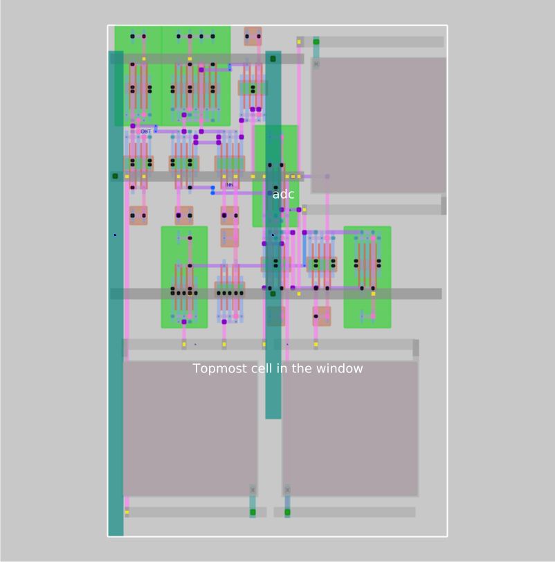

After extracting and adding ngspice commands and .lib to the spice file
```
* SPICE3 file created from adc.ext - technology: sky130A

.subckt adc INP GND VDD INN OUT
X0 GND INP sky130_fd_pr__cap_mim_m3_1 l=10 w=10
X1 GND m3_4894_4713# sky130_fd_pr__cap_mim_m3_1 l=10 w=10
X2 GND li_577_5947# OUT GND sky130_fd_pr__nfet_01v8 ad=0.2226 pd=2.21 as=0.1176 ps=1.12 w=0.84 l=0.15
X3 OUT li_577_5947# GND GND sky130_fd_pr__nfet_01v8 ad=0.1176 pd=1.12 as=0.2226 ps=2.21 w=0.84 l=0.15
X4 GND li_577_5947# OUT GND sky130_fd_pr__nfet_01v8 ad=0.1176 pd=1.12 as=0.1176 ps=1.12 w=0.84 l=0.15
X5 OUT li_577_5947# GND GND sky130_fd_pr__nfet_01v8 ad=0.1176 pd=1.12 as=0.1176 ps=1.12 w=0.84 l=0.15
X6 OUT li_577_5947# VDD VDD sky130_fd_pr__pfet_01v8 ad=0.1176 pd=1.12 as=0.2226 ps=2.21 w=0.84 l=0.15
X7 VDD li_577_5947# OUT VDD sky130_fd_pr__pfet_01v8 ad=0.1176 pd=1.12 as=0.1176 ps=1.12 w=0.84 l=0.15
X8 OUT li_577_5947# VDD VDD sky130_fd_pr__pfet_01v8 ad=0.1176 pd=1.12 as=0.1176 ps=1.12 w=0.84 l=0.15
X9 VDD li_577_5947# OUT VDD sky130_fd_pr__pfet_01v8 ad=0.2226 pd=2.21 as=0.1176 ps=1.12 w=0.84 l=0.15
X10 GND m3_4464_2589# sky130_fd_pr__cap_mim_m3_1 l=10 w=10
X11 GND INP m3_4464_2589# GND sky130_fd_pr__nfet_01v8 ad=0.2226 pd=2.21 as=0.1176 ps=1.12 w=0.84 l=0.15
X12 m3_4464_2589# INP GND GND sky130_fd_pr__nfet_01v8 ad=0.1176 pd=1.12 as=0.2226 ps=2.21 w=0.84 l=0.15
X13 GND INP m3_4464_2589# GND sky130_fd_pr__nfet_01v8 ad=0.1176 pd=1.12 as=0.1176 ps=1.12 w=0.84 l=0.15
X14 m3_4464_2589# INP GND GND sky130_fd_pr__nfet_01v8 ad=0.1176 pd=1.12 as=0.1176 ps=1.12 w=0.84 l=0.15
X15 m3_4464_2589# INP VDD VDD sky130_fd_pr__pfet_01v8 ad=0.1176 pd=1.12 as=0.2226 ps=2.21 w=0.84 l=0.15
X16 VDD INP m3_4464_2589# VDD sky130_fd_pr__pfet_01v8 ad=0.1176 pd=1.12 as=0.1176 ps=1.12 w=0.84 l=0.15
X17 m3_4464_2589# INP VDD VDD sky130_fd_pr__pfet_01v8 ad=0.1176 pd=1.12 as=0.1176 ps=1.12 w=0.84 l=0.15
X18 VDD INP m3_4464_2589# VDD sky130_fd_pr__pfet_01v8 ad=0.2226 pd=2.21 as=0.1176 ps=1.12 w=0.84 l=0.15
X19 GND m1_1258_5936# m1_1860_5852# GND sky130_fd_pr__nfet_01v8 ad=0.2226 pd=2.21 as=0.1176 ps=1.12 w=0.84 l=0.15
X20 m1_1860_5852# m1_1258_5936# GND GND sky130_fd_pr__nfet_01v8 ad=0.1176 pd=1.12 as=0.2226 ps=2.21 w=0.84 l=0.15
X21 GND m1_1258_5936# m1_1860_5852# GND sky130_fd_pr__nfet_01v8 ad=0.1176 pd=1.12 as=0.1176 ps=1.12 w=0.84 l=0.15
X22 m1_1860_5852# m1_1258_5936# GND GND sky130_fd_pr__nfet_01v8 ad=0.1176 pd=1.12 as=0.1176 ps=1.12 w=0.84 l=0.15
X23 INP m3_4894_4713# VDD VDD sky130_fd_pr__pfet_01v8 ad=0.1176 pd=1.12 as=0.2226 ps=2.21 w=0.84 l=0.15
X24 VDD m3_4894_4713# INP VDD sky130_fd_pr__pfet_01v8 ad=0.1176 pd=1.12 as=0.1176 ps=1.12 w=0.84 l=0.15
X25 INP m3_4894_4713# VDD VDD sky130_fd_pr__pfet_01v8 ad=0.1176 pd=1.12 as=0.1176 ps=1.12 w=0.84 l=0.15
X26 VDD m3_4894_4713# INP VDD sky130_fd_pr__pfet_01v8 ad=0.2226 pd=2.21 as=0.1176 ps=1.12 w=0.84 l=0.15
X27 GND m3_4894_4713# INP GND sky130_fd_pr__nfet_01v8 ad=3.402 pd=33.3 as=0.4704 ps=4.48 w=0.84 l=0.15
X28 INP m3_4894_4713# GND GND sky130_fd_pr__nfet_01v8 ad=0 pd=0 as=0 ps=0 w=0.84 l=0.15
X29 GND m3_4894_4713# INP GND sky130_fd_pr__nfet_01v8 ad=0 pd=0 as=0 ps=0 w=0.84 l=0.15
X30 INP m3_4894_4713# GND GND sky130_fd_pr__nfet_01v8 ad=0 pd=0 as=0 ps=0 w=0.84 l=0.15
X31 m3_4894_4713# m3_4464_2589# VDD VDD sky130_fd_pr__pfet_01v8 ad=0.4704 pd=4.48 as=3.8724 ps=37.78 w=0.84 l=0.15
X32 VDD m3_4464_2589# m3_4894_4713# VDD sky130_fd_pr__pfet_01v8 ad=0 pd=0 as=0 ps=0 w=0.84 l=0.15
X33 m3_4894_4713# m3_4464_2589# VDD VDD sky130_fd_pr__pfet_01v8 ad=0 pd=0 as=0 ps=0 w=0.84 l=0.15
X34 VDD m3_4464_2589# m3_4894_4713# VDD sky130_fd_pr__pfet_01v8 ad=0 pd=0 as=0 ps=0 w=0.84 l=0.15
X35 GND m3_4464_2589# m3_4894_4713# GND sky130_fd_pr__nfet_01v8 ad=0 pd=0 as=0.4704 ps=4.48 w=0.84 l=0.15
X36 m3_4894_4713# m3_4464_2589# GND GND sky130_fd_pr__nfet_01v8 ad=0 pd=0 as=0 ps=0 w=0.84 l=0.15
X37 GND m3_4464_2589# m3_4894_4713# GND sky130_fd_pr__nfet_01v8 ad=0 pd=0 as=0 ps=0 w=0.84 l=0.15
X38 m3_4894_4713# m3_4464_2589# GND GND sky130_fd_pr__nfet_01v8 ad=0 pd=0 as=0 ps=0 w=0.84 l=0.15
X39 VDD m1_1258_5936# m1_1258_5936# VDD sky130_fd_pr__pfet_01v8 ad=0.2226 pd=2.21 as=0.1176 ps=1.12 w=0.84 l=0.15
X40 li_577_5947# m1_1258_5936# VDD VDD sky130_fd_pr__pfet_01v8 ad=0.1176 pd=1.12 as=0.1176 ps=1.12 w=0.84 l=0.15
X41 m1_1258_5936# m1_1258_5936# VDD VDD sky130_fd_pr__pfet_01v8 ad=0.1176 pd=1.12 as=0.2226 ps=2.21 w=0.84 l=0.15
X42 VDD m1_1258_5936# m1_1258_5936# VDD sky130_fd_pr__pfet_01v8 ad=0.1176 pd=1.12 as=0.1176 ps=1.12 w=0.84 l=0.15
X43 VDD m1_1258_5936# li_577_5947# VDD sky130_fd_pr__pfet_01v8 ad=0.1176 pd=1.12 as=0.1176 ps=1.12 w=0.84 l=0.15
X44 li_577_5947# m1_1258_5936# VDD VDD sky130_fd_pr__pfet_01v8 ad=0.1176 pd=1.12 as=0.1176 ps=1.12 w=0.84 l=0.15
X45 m1_1258_5936# m1_1258_5936# VDD VDD sky130_fd_pr__pfet_01v8 ad=0.1176 pd=1.12 as=0.1176 ps=1.12 w=0.84 l=0.15
X46 VDD m1_1258_5936# li_577_5947# VDD sky130_fd_pr__pfet_01v8 ad=0.1176 pd=1.12 as=0.1176 ps=1.12 w=0.84 l=0.15
X47 m1_1860_5852# INN m1_1258_5936# GND sky130_fd_pr__nfet_01v8 ad=0.2226 pd=2.21 as=0.1176 ps=1.12 w=0.84 l=0.15
X48 m1_1258_5936# INN m1_1860_5852# GND sky130_fd_pr__nfet_01v8 ad=0.1176 pd=1.12 as=0.2226 ps=2.21 w=0.84 l=0.15
X49 m1_1860_5852# INN m1_1258_5936# GND sky130_fd_pr__nfet_01v8 ad=0.1176 pd=1.12 as=0.1176 ps=1.12 w=0.84 l=0.15
X50 m1_1258_5936# INN m1_1860_5852# GND sky130_fd_pr__nfet_01v8 ad=0.1176 pd=1.12 as=0.1176 ps=1.12 w=0.84 l=0.15
X51 m1_1860_5852# INP li_577_5947# GND sky130_fd_pr__nfet_01v8 ad=1.8312 pd=17.8 as=0.4704 ps=4.48 w=0.84 l=0.15
X52 li_577_5947# INP m1_1860_5852# GND sky130_fd_pr__nfet_01v8 ad=0 pd=0 as=0 ps=0 w=0.84 l=0.15
X53 m1_1860_5852# INP li_577_5947# GND sky130_fd_pr__nfet_01v8 ad=0 pd=0 as=0 ps=0 w=0.84 l=0.15
X54 li_577_5947# INP m1_1860_5852# GND sky130_fd_pr__nfet_01v8 ad=0 pd=0 as=0 ps=0 w=0.84 l=0.15
C0 VDD m3_4464_2589# 5.36fF
C1 VDD INP 5.02fF
C2 VDD m1_1258_5936# 5.23fF
C3 m3_4894_4713# VDD 4.40fF
C4 VDD li_577_5947# 3.87fF
C5 m3_4464_2589# GND 7.43fF 
C6 INP GND 10.39fF
C7 m3_4894_4713# GND 6.90fF 
C8 m1_1860_5852# GND 2.04fF 
C9 VDD GND 22.06fF
.ends


x1 INP GND VDD INN OUT adc

V1 VDD GND 1.8
.save i(v1)
V2 INN GND 1
.save i(v2)

.lib /home/pramit/EDA_TOOLS/skywater-pdk/libraries/sky130_fd_pr/latest/models/sky130.lib.spice tt


.tran 0.1n 25n
.save all
.control

run
plot INP INN OUT
.endc
.end

```
We simulate using ngspice and achieve the following postlayout simulation.
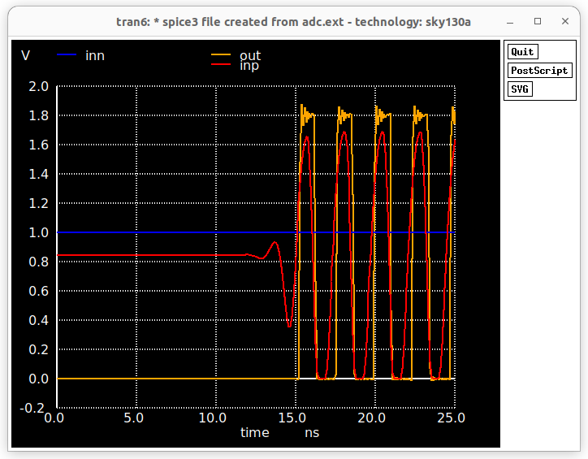

From the above shown figure it is evident that both the prelayout and postlayout simulations match and is working as intended. So proceeding to the next stage.

For proceeding further with OpenFASOC flow the gds files need to be processed to remove hierarchy and rename the top cells as shown in the video demo below.
Then the gds is saved and lef is extracted from that gds file. To make correct lef file we need to place the whole layout to the (0,0) position so that after final placement in OpenFASOC the macros are placed in the correct place without any undesirable offset.
Convert all labels to Ports by doing ``port makeall`` and then extract lef by `` lef writeall``.
The whole process is shown below.


https://user-images.githubusercontent.com/41202066/227779352-3fa465ea-1032-447c-af98-7da3b0d3bf26.mp4


## 10c. OpenFASOC verilog Source files 
To correctly link the gds and lef files to the OpenFASOC flow the verilog files plays a very important role.
The top level verilog is named as ``async_up_down.v`` and the other two macros as the same cell name given in the gds like ``COMPARATOR.v`` and ``RING_OSCILLATOR.v``.
The source files are shown below:

async_up_down.v    ---
```
module async_up_down(
    input wire in_bias,
    input wire in_inn,
    output wire  out_adc
);

wire ring_adc;

RING_OSCILLATOR ring_osc(
    .INP(ring_adc)
);

COMPARATOR one_bit_adc(
    .INP(ring_adc),
    .INN(in_inn),
    .BIAS(in_bias),
    .OUT(out_adc)
);

endmodule


```
COMPARATOR.v    ---
```
module COMPARATOR(
    input BIAS,
    input INN,
    input INP,
    output OUT
);
endmodule

```
RING_OSCILLATOR.v    ---
```
module RING_OSCILLATOR(
    output INP
);
endmodule
```
# WEEK 5
## OpenFASoC Flow
+ ## Directory preparation
    To run the OpenFASOC flow simply clone this repo and Copy the folder from ``msvsd32bitsram/week5/async_up_down-gen/`` to ``OpenFASOC/Openfasoc/generators/``
+ ## Important files and directories
    The gds fils are present in ``async_up_down-gen/blocks/gds/`` and the lef files are in ``async_up_down-gen/blocks/lef/``.
    Apart from that four more files are also needed.
    
    i) async_up_down_custom_net.txt --
    ```
    r_VIN
    RING_OSCILLATOR0 VIN
    COMPARATOR0 VIN
    ```
    ii) async_up_down_domain_insts.txt --
    ```
    RING_OSCILLATOR0
    COMPARATOR0 
    ```
    iii) manual_macro.tcl --
    ```
    ring_osc N 35 30
    one_bit_adc N 50 30

    ```
    iv) pdn.tcl -- 
```
    ####################################
    # global connections
    ####################################
    add_global_connection -defer_connection -net {VDD} -inst_pattern {.*} -pin_pattern {^VDD$} -power
    add_global_connection -defer_connection -net {VDD} -inst_pattern {.*} -pin_pattern {^VDDPE$}
    add_global_connection -defer_connection -net {VDD} -inst_pattern {.*} -pin_pattern {^VDDCE$}
    add_global_connection -defer_connection -net {VDD} -inst_pattern {.*} -pin_pattern {VPWR}
    add_global_connection -defer_connection -net {VDD} -inst_pattern {.*} -pin_pattern {VPB}
    add_global_connection -defer_connection -net {VSS} -inst_pattern {.*} -pin_pattern {^VSS$} -ground
    add_global_connection -defer_connection -net {VSS} -inst_pattern {.*} -pin_pattern {^VSSE$}
    add_global_connection -defer_connection -net {VSS} -inst_pattern {.*} -pin_pattern {VGND}
    add_global_connection -defer_connection -net {VSS} -inst_pattern {.*} -pin_pattern {VNB}
    global_connect
    ####################################
    # voltage domains
    ####################################
    set_voltage_domain -name {CORE} -power {VDD} -ground {VSS}
    ####################################
    # standard cell grid
    ####################################
    define_pdn_grid -name {grid} -voltage_domains {CORE}
    add_pdn_stripe -grid {grid} -layer {met1} -width {0.48} -pitch {5.44} -offset {0} -followpins
    add_pdn_stripe -grid {grid} -layer {met4} -width {1.600} -pitch {27.140} -offset {13.570}
    add_pdn_stripe -grid {grid} -layer {met5} -width {1.600} -pitch {27.200} -offset {13.600}
    add_pdn_connect -grid {grid} -layers {met1 met4}
    add_pdn_connect -grid {grid} -layers {met4 met5}
    ####################################
    # macro grids
    ####################################
    ####################################
    # grid for: CORE_macro_grid_1
    ####################################
    define_pdn_grid -name {CORE_macro_grid_1} -voltage_domains {CORE} -macro -orient {R0 R180 MX MY} -halo {2.0 2.0 2.0 2.0} -default -grid_over_boundary
    add_pdn_connect -grid {CORE_macro_grid_1} -layers {met4 met5}
    ####################################
    # grid for: CORE_macro_grid_2
    ####################################
    define_pdn_grid -name {CORE_macro_grid_2} -voltage_domains {CORE} -macro -orient {R90 R270 MXR90 MYR90} -halo {2.0 2.0 2.0 2.0} -default -grid_over_boundary
    add_pdn_connect -grid {CORE_macro_grid_2} -layers {met4 met5}

```
    

The ``manual_macro.txt`` file is necessary to set the postion of the individual macros in the core area.

Now most importantly the power delivery network is very important, because it is needed for the correct connections of VDD and GND to VPWR and VGND of the whole CORE. This step is yet to be figured out.

Next is the ``config.mk`` file which is used to set the env variables needed for the OpenROAD flow. It is present in ``async_up_down-gen/flow/design/sky130hd/async_up_down/config.mk``

```
export DESIGN_NICKNAME = async_up_down
export DESIGN_NAME = async_up_down

export PLATFORM    = sky130hd

export VERILOG_FILES 		= $(sort $(wildcard ./design/src/$(DESIGN_NICKNAME)/*.v)) 
#../blocks/$(PLATFORM)/tempsenseInst.blackbox.v
export SDC_FILE    		= ./design/$(PLATFORM)/$(DESIGN_NICKNAME)/constraint.sdc

export DIE_AREA   	 	= 0 0 120 90
export CORE_AREA   		= 15 15 100 70

# area of the smaller voltage domain
#export VDD_AREA                 = 20 20 20 21

# power delivery network config file
export PDN_TCL 			= ../blocks/$(PLATFORM)/pdn.tcl

export ADDITIONAL_LEFS  	= ../blocks/$(PLATFORM)/lef/COMPARATOR.lef \
                        	  ../blocks/$(PLATFORM)/lef/RING_OSCILLATOR.lef

export ADDITIONAL_GDS_FILES 	= ../blocks/$(PLATFORM)/gds/COMPARATOR.gds \
			      	  ../blocks/$(PLATFORM)/gds/RING_OSCILLATOR.gds

# informs what cells should be placed in the smaller voltage domain
export DOMAIN_INSTS_LIST 	= ../blocks/$(PLATFORM)/async_up_down_domain_insts.txt

# configuration for placement
export MACRO_PLACE_HALO         = 1 1
export MACRO_PLACE_CHANNEL      = 30 30
export MACRO_PLACEMENT          = ../blocks/$(PLATFORM)/manual_macro.tcl


# don't run global place w/o IOs
#export HAS_IO_CONSTRAINTS = 1
# don't run non-random IO placement (step 3_2)
export PLACE_PINS_ARGS = -random

export GPL_ROUTABILITY_DRIVEN = 1

# DPO optimization currently fails on the tempsense
export ENABLE_DPO = 0

#export CELL_PAD_IN_SITES_GLOBAL_PLACEMENT = 4
#export CELL_PAD_IN_SITES_DETAIL_PLACEMENT = 2

# configuration for routing

#export PRE_GLOBAL_ROUTE = $(SCRIPTS_DIR)/openfasoc/pre_global_route.tcl

# informs any short circuits that should be forced during routing
export CUSTOM_CONNECTION 	= ../blocks/$(PLATFORM)/async_up_down_custom_net.txt

# indicates with how many connections the VIN route from the HEADER cells connects to the VIN power ring
export VIN_ROUTE_CONNECTION_POINTS = 3

```
Next comes ``test.json`` file for defining the actual design generator name and defining specifications for frequency and other parameters as needed.
```
{
    "module_name": "async-up-down",
    "generator": "async_up_down-gen",
    "specifications": {
    	"frequency": { "min": 5, "max": 1200 }
    }
}

```
Setting up source ``tools/*.py`` files. Edit as required and be sure to define the gds and lef files along with the verilog files in ``async-up-down-gen.py`` file as
```
#!/usr/bin/python3

import json
import os
import re
import shutil
import subprocess as sp
import sys
import time


from parameter import args, check_search_done, designName
#from simulation import generate_runs

genDir = os.path.join(os.path.dirname(os.path.relpath(__file__)), "../")
srcDir = genDir + "src/"
flowDir = genDir + "flow/"
designDir = genDir + "designs/src/async_up_down/"
simDir = genDir + "simulations/"
commonDir = genDir + "../../common/"
platformDir = genDir + "../../common/platforms/" + args.platform + "/"
objDir = flowDir + "objects/" + args.platform + "/async_up_down/"

# ------------------------------------------------------------------------------
# Clean the workspace
# ------------------------------------------------------------------------------
print("#----------------------------------------------------------------------")
print("# Cleaning the workspace...")
print("#----------------------------------------------------------------------")
if args.clean:
    p = sp.Popen(["make", "clean_all"], cwd=genDir)
    p.wait()

p = sp.Popen(["git", "checkout", platformDir + "cdl/sky130_fd_sc_hd.spice"])
p.wait()

print("Loading platform_config file...")
print()
try:
    with open(genDir + "../../common/platform_config.json") as file:
        jsonConfig = json.load(file)
except ValueError as e:
    print("Error occurred opening or loading json file.")
    print >> sys.stderr, "Exception: %s" % str(e)
    sys.exit(1)

print("PDK_ROOT value: {}".format(os.getenv("PDK_ROOT")))


pdk = None
if os.getenv("PDK_ROOT") is not None:
    pdk = os.path.join(os.environ["PDK_ROOT"], "sky130A")
else:
    open_pdks_key = "open_pdks"
    pdk = jsonConfig[open_pdks_key]

if not os.path.isdir(os.path.join(pdk, "libs.ref")):
    print("Cannot find libs.ref folder from open_pdks in " + pdk)
    sys.exit(1)
elif not os.path.isdir(os.path.join(pdk, "libs.tech")):
    print("Cannot find libs.tech folder from open_pdks in " + pdk)
    sys.exit(1)
else:
    sky130A_path = commonDir + "drc-lvs-check/sky130A/"
    if not os.path.isdir(sky130A_path):
        os.mkdir(sky130A_path)
    try:
        sp.Popen(
            [
                "sed -i 's/set PDKPATH \".*/set PDKPATH $env(PDK_ROOT)\/sky130A/' $PDK_ROOT/sky130A/libs.tech/magic/sky130A.magicrc"
            ],
            shell=True,
        ).wait()
    except:
        pass
    shutil.copy2(os.path.join(pdk, "libs.tech/magic/sky130A.magicrc"), sky130A_path)
    shutil.copy2(os.path.join(pdk, "libs.tech/netgen/sky130A_setup.tcl"), sky130A_path)

print("#----------------------------------------------------------------------")
print("# Verilog Generation")
print("#----------------------------------------------------------------------")


if args.platform == "sky130hd":
    aux1 = "COMPARATOR"
    aux2 = "RING_OSCILLATOR"
elif args.platform == "sky130hs":
    aux1 = "COMPARATOR_hs"
    aux2 = "RING_OSCILLATOR_hs"

shutil.copyfile(srcDir + "async_up_down.v", flowDir + "design/src/async_up_down/async_up_down" + ".v")
shutil.copyfile(srcDir + "COMPARATOR.v", flowDir + "design/src/async_up_down/COMPARATOR" + ".v")
shutil.copyfile(srcDir + "RING_OSCILLATOR.v", flowDir + "design/src/async_up_down/RING_OSCILLATOR" + ".v")

print("#----------------------------------------------------------------------")
print("# Verilog Generated")
print("#----------------------------------------------------------------------")
print()
if args.mode == "verilog":
    print("Exiting tool....")
    exit()

print("#----------------------------------------------------------------------")
print("# Run Synthesis and APR")
print("#----------------------------------------------------------------------")

p = sp.Popen(["make", "finish"], cwd=flowDir)
p.wait()
if p.returncode:
    print("[Error] Place and Route failed. Refer to the log file")
    exit(1)

print("#----------------------------------------------------------------------")
print("# Place and Route finished")
print("#----------------------------------------------------------------------")

p = sp.Popen(["make", "magic_drc"], cwd=flowDir)
p.wait()
if p.returncode:
    print("[Error] DRC failed. Refer to the report")
    exit(1)

print("#----------------------------------------------------------------------")
print("# DRC finished")
print("#----------------------------------------------------------------------")

if os.path.isdir(args.outputDir):
    # shutil.rmtree(genDir + args.outputDir)
    pass
if not args.outputDir.startswith("/"):
    os.mkdir(genDir + args.outputDir)
    outputDir = genDir + args.outputDir
else:
    os.mkdir(args.outputDir)
    outputDir = args.outputDir

shutil.copyfile(
    flowDir + "results/" + args.platform + "/async_up_down/6_final.gds",
    outputDir + "/" + designName + ".gds",
)
shutil.copyfile(
    flowDir + "results/" + args.platform + "/async_up_down/6_final.def",
    outputDir + "/" + designName + ".def",
)
shutil.copyfile(
    flowDir + "results/" + args.platform + "/async_up_down/6_final.v",
    outputDir + "/" + designName + ".v",
)
shutil.copyfile(
    flowDir + "results/" + args.platform + "/async_up_down/6_1_fill.sdc",
    outputDir + "/" + designName + ".sdc",
)

shutil.copyfile(
    flowDir + "reports/" + args.platform + "/async_up_down/6_final_drc.rpt",
    outputDir + "/6_final_drc.rpt",
)

print("Exiting tool....")
exit()
```
along with ``parameter.py``, ``parse_rpt.py`` and ``verify_op.sh``. 
To make and compile the design prepare the ``async_up_down-gen/Makefile`` as follows
```


sky130hd_verilog:
	@@echo "=============================================================="
	@@echo " __ 	   __ ____ ____   _____ _     ___   ___ "
	@@echo " \ \      / /|  __|  _  \|_   _| |   / _ \ / __\ "
	@@echo "  \ \    / / | |_|| |_) |  | | | |  | | | | |  _ " 
	@@echo "   \ \__/ /  | |__|  __/  _| |_| |__| |_| | |_| | "
	@@echo "    \____/   |____|_|\_\ |_____|____|\___/ \___/ "
	@@echo "~~~~~~~~~~~~~~~~~~~~~~~~~~~~~~~~~~~~~~~~~~~~~~~~~~~~~"
	@@echo "OpenFASoC For Verilog Generation"
	@@echo "==============================================================="
	@python3 tools/async-up-down-gen.py --specfile test.json --outputDir ./work --platform sky130hd --mode verilog
	
sky130hd_build:
	@python3 tools/async-up-down-gen.py --specfile test.json --outputDir ./work --platform sky130hd --mode full 
	@python3 tools/parse_rpt.py
	@@echo "==============================================================="
	@@echo "Thank you for using OpenFASOC"
	@@echo "=============================================================="
	@@echo "   ___  _____ ______ _   _ _____  _     ____   ___   ____"
	@@echo "  / _ \|  _  \| ____| \ | |  ___|/ \   / ___| / _ \ / ___|"
	@@echo " | | | | |_) ||  _| |  \| | |_  / _ \  \___ \| | | | |    "
	@@echo " | |_| |  __/ | |___| |\  |  _|/ ___ \  ___) | |_| | |___ "
	@@echo "  \___/|_|    |_____|_| \_|_| /_/   \_\|____/ \___/ \____|"
	@@echo ""
	@@echo "==============================================================="


verilog:
	@@echo "=============================================================="
	@@echo " __ 	   __ ____ ____   _____ _     ___   ___ "
	@@echo " \ \      / /|  __|  _  \|_   _| |   / _ \ / __\ "
	@@echo "  \ \    / / | |_|| |_) |  | | | |  | | | | |  _ " 
	@@echo "   \ \__/ /  | |__|  __/  _| |_| |__| |_| | |_| | "
	@@echo "    \____/   |____|_|\_\ |_____|____|\___/ \___/ "
	@@echo "~~~~~~~~~~~~~~~~~~~~~~~~~~~~~~~~~~~~~~~~~~~~~~~~~~~~~"
	@@echo "OpenFASoC For Verilog Generation"
	@@echo "==============================================================="

banner:
	@@echo "=============================================================="
	@@echo "   ___  _____ ______ _   _ _____  _     ____   ___   ____"
	@@echo "  / _ \|  _  \| ____| \ | |  ___|/ \   / ___| / _ \ / ___|"
	@@echo " | | | | |_) ||  _| |  \| | |_  / _ \  \___ \| | | | |    "
	@@echo " | |_| |  __/ | |___| |\  |  _|/ ___ \  ___) | |_| | |___ "
	@@echo "  \___/|_|    |_____|_| \_|_| /_/   \_\|____/ \___/ \____|"
	@@echo ""
	@@echo "==============================================================="

```
## Setting Up a Python Notebook For Quick n Easy OpenFASOC flow

* **Week5 OPENFASOC Notebook**

    [](https://colab.research.google.com/github/pramitpal/msvsd32bitsram/blob/main/week5/OPENFASOC_NOTEBOOK.ipynb)

## Running the flow
To run the flow correctly do a ``make clean_all`` first by going to the ``./flow`` dir.
```
!cd async_up_down-gen/flow && make clean_all
```
To synthesize the Verilog cd to the main ``async_up_down-gen`` dir and do ``make sky130hd_verilog``
```
!cd async_up_down-gen/ && make sky130hd_verilog
```
To run the whole flow
```
!cd async_up_down-gen/ && make sky130hd_build
```
## Logs of the flow
+ ## Clean and make Verilog
    
+ ## Synthesis and APR
    
    
+ ## Floorplan
    
+ ## Global Place
    
+ ## Detailed Place
    
+ ## Gobal Route
    
+ ## Antennae Check
    
+ ## Report Check
    
+ ## DRC Check
    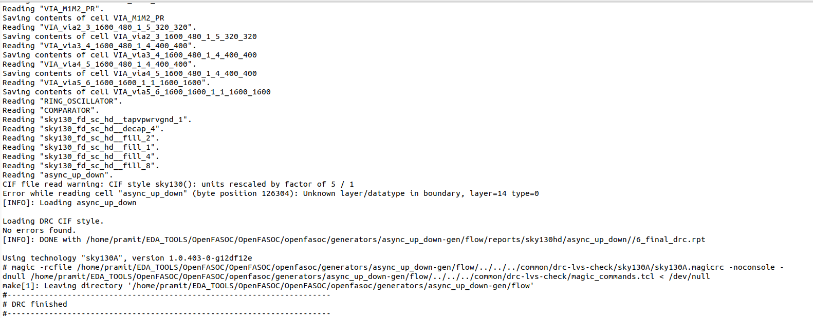

## Final Layout(DRC Clean)
+ Note-> ``The async_up_down-gen`` is present in [async_up_down-gen](week5/mine/async_up_down-gen)
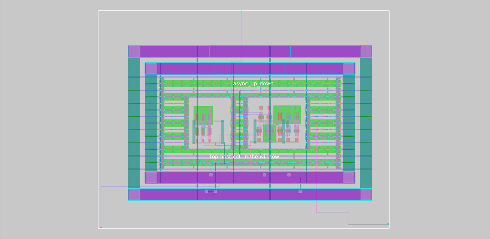
+ ## COMPARATOR Macro Placement
    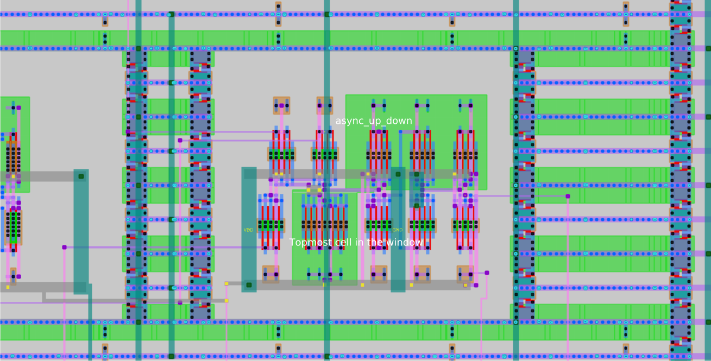
+ ## RING_OSCILLATOR Macro Placement
    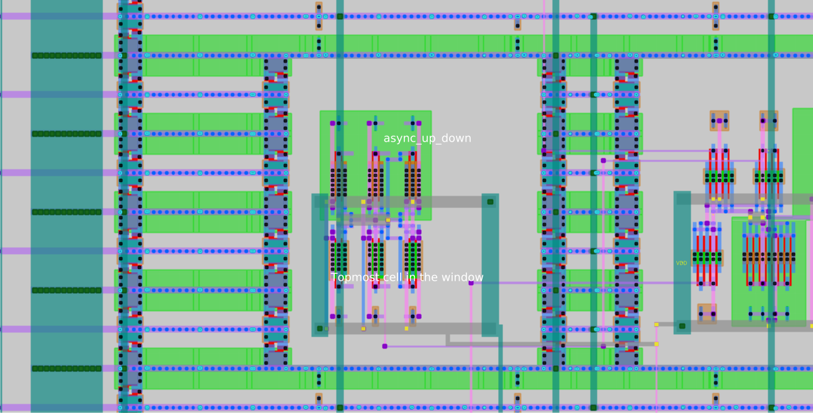
## Layout Dimensions
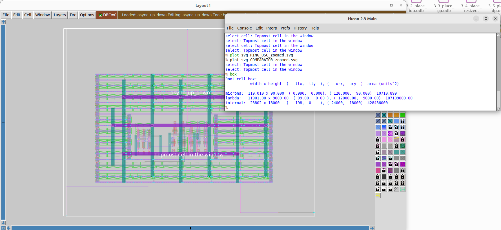
The layout dimension seems correct according to the set Core and DIE area in the config.mk file.
The DIE Area was set to ``120 micron X 90 micron`` which is correct and the macros are placed in the positions, COMPARATOR at (35,30) and RING_OSCILLATOR at (50,30).

## Power Delivery Network and VDD and GND connection
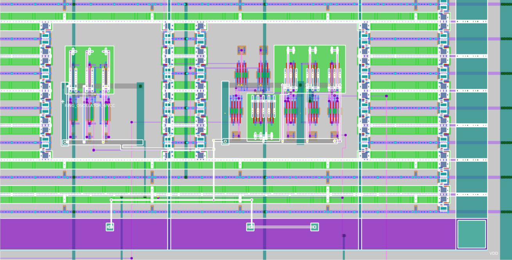
If you look closely, you can see that the higlited routes shows that the core and macro VDD are actually connected.
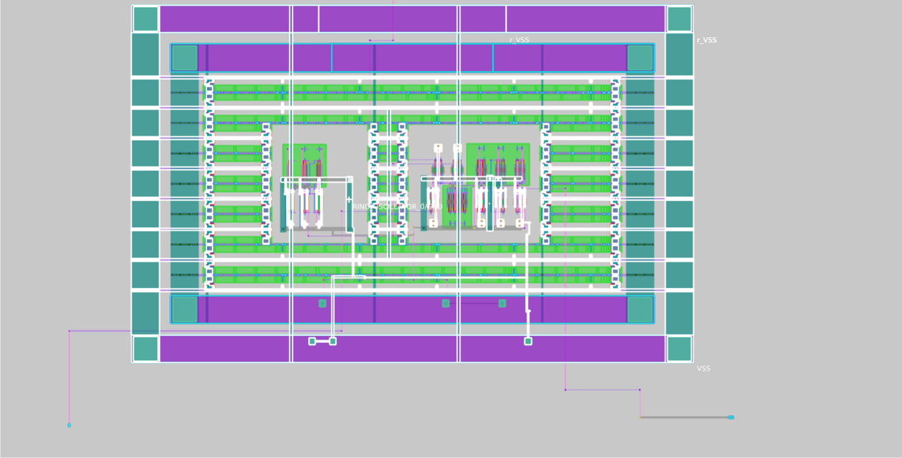
If you look closely, you can see that the higlited routes shows that the core and macro VSS are actually connected.

The above images show that the VDD and VSS are actually connected to the macros.
For setting up the routable nets for making the power pin connections to the macro, many files need to be edited manually, ``pdn.tcl, config.mk, pre_global_route.tcl``, adding 2 new files for adding custom connections to the macro power and ground lines--``async_up_down_VSS_connection.tcl`` and ``async_up_down_VDD_connection.tcl``. Further ``manual_macro.tcl`` is necessary to set the macro positions and to fine tune if unwanted drc errors pop up. Also ``add_ndr_rules.txt`` must be edited to add VDD and VSS custom routings correctly. 
For future reference I am explaining the files a bit.
``pdn.tcl``
```
####################################

# global connections

####################################

add_global_connection -net VDD -inst_pattern {.*} -pin_pattern {VPWR|VPB} -power ;# default: VDD as power

add_global_connection -net VSS -inst_pattern {.*} -pin_pattern {VGND|VNB} -ground

global_connect

####################################

# voltage domains

####################################

set_voltage_domain -name {CORE} -power {VDD} -ground {VSS}


####################################

# standard cell grid

####################################

define_pdn_grid -name stdcell -pins met5 -starts_with POWER -voltage_domains CORE


## horizontal lines-----

add_pdn_stripe -grid {stdcell} -layer {met1} -width {0.48} -pitch {5} -offset {2.0} -extend_to_core_ring -followpins


add_pdn_ring -grid stdcell -layer {met4 met5} -widths {5.0 5.0} -spacings {2.0 2.0} -core_offsets {1.0 1.0}

##----vertical lines


add_pdn_stripe -grid {stdcell} -layer {met4} -width {0.48} -pitch {30} -offset {0.5} -extend_to_core_ring


add_pdn_connect -grid {stdcell} -layers {met1 met4}

add_pdn_connect -grid {stdcell} -layers {met4 met5}


```
``add_pdn_ring`` is used to define a ring for delivering power an gnd to the core which is also used by the macros, so extra power domains is not necessary in this case.
For adding horizontal connections between filler and tapcells, the following stripe definitions is needed and horizontal is actually differentiated by ``-followpins``.

```
add_pdn_stripe -grid {stdcell} -layer {met1} -width {0.48} -pitch {5} -offset {2.0} -extend_to_core_ring -followpins
```
For adding vertical connections between filler and tapcells, the following stripe definitions is needed. Here the vertical layers is using metal4 so is defined, here ``-pitch {30}`` defines the distance between consecutive power and gnd lines.(Note: if facing drc errors manually adjust the pitch and offset values).
```
##----vertical lines
add_pdn_stripe -grid {stdcell} -layer {met4} -width {0.48} -pitch {30} -offset {0.5} -extend_to_core_ring
```
As mentioned earlier, the macros dont require a separate voltage domain so only the CORE domain will suffice.

Next in ``config.mk`` these need to be edited as needed. for macro placement--
```
# configuration for placement

export MACRO_PLACE_HALO         = 1 1

export MACRO_PLACE_CHANNEL      = 30 30

export MACRO_PLACEMENT          = ../blocks/$(PLATFORM)/manual_macro.tcl

```

For addinf custom connections to macro power and gnd. Here I found that we can only define one net like VDD or VSS in one file.

```
# configuration for routing
export PRE_GLOBAL_ROUTE = $(SCRIPTS_DIR)/openfasoc/pre_global_route.tcl
# informs any short circuits that should be forced during routing
export GND_VSS_CONNECTION 	= ../blocks/$(PLATFORM)/async_up_down_VSS_connection.txt
export VDD_VDD_CONNECTION 	= ../blocks/$(PLATFORM)/async_up_down_VDD_connection.txt
```
Next is ``pre_global_route.tcl`` file
```
# Create r_VIN net

source $::env(SCRIPTS_DIR)/openfasoc/create_routable_power_net.tcl

create_routable_power_net "VSS" $::env(VIN_ROUTE_CONNECTION_POINTS)

create_routable_power_net "VDD" $::env(VIN_ROUTE_CONNECTION_POINTS)


# NDR rules

source $::env(SCRIPTS_DIR)/openfasoc/add_ndr_rules.tcl


# Custom connections

source $::env(SCRIPTS_DIR)/openfasoc/create_custom_connections.tcl

if {[info exist ::env(GND_VSS_CONNECTION)]} {

  create_custom_connections $::env(GND_VSS_CONNECTION)

}

if {[info exist ::env(VDD_VDD_CONNECTION)]} {

  create_custom_connections $::env(VDD_VDD_CONNECTION)

}
```
Here create_custom_connections is used to define the vdd and vss connections we defined earlier.

Next ``add_ndr_rules.tcl`` this file needs editing and although not that critical, it ensures that the certain routing rules are followed for routing the power and vss.
```
set block [ord::get_db_block]


# Add 2W, 2S rule to ring oscillator input

create_ndr -name NDR_5W_5S \

           -spacing { *5 } \

           -width { *5 }


set ndr [$block findNonDefaultRule NDR_5W_5S]

$ndr setHardSpacing 1


assign_ndr -ndr NDR_5W_5S -net VSS

assign_ndr -ndr NDR_5W_5S -net VDD
```
The files async_up_down_VDD_connection.txt has the definitions for the macro power nets
```
r_VDD

ring_osc VCC

one_bit_adc VDD
```
similarly, the file async_up_down_VSS_connection.txt has the definitions for the macro ground nets
```
r_VSS

ring_osc GND

one_bit_adc GND
```
One more important bit is to set the correct name of the name of the instance used while defining in the dummy verilog files, like if RING_OSCILLATOR was defined as ``RING_OSCILLATOR ring_osc(....) `` the async_up_down_domain_insts.txt also need to have the same name- ``ring_osc``.
the file contents are below.
```
ring_osc

one_bit_adc
```

[FLOW_LDO_README](https://github.com/idea-fasoc/OpenFASOC/blob/b9784507aac426970b56492f8327033e1a4feb15/docs/source/flow-ldo.rst)

In order to Set this up properly knowledge of Power delivery network, voltage region setting and power grid pitch adjustment is necessary. This is still pending.


## References
http://opencircuitdesign.com/magic/   
http://opencircuitdesign.com/open_pdks/   
https://xschem.sourceforge.io/stefan/xschem_man/xschem_man.html    
https://sourceforge.net/p/ngspice/discussion/   


